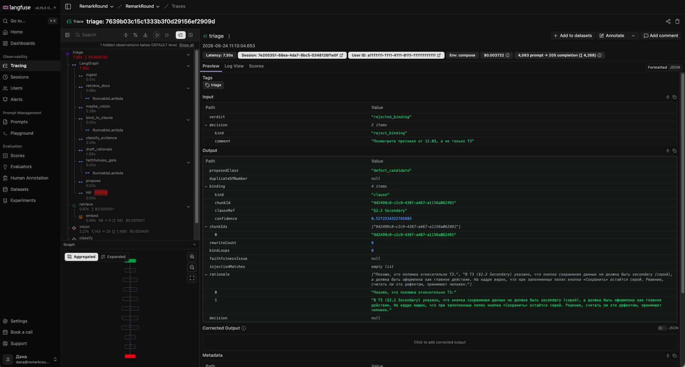

# RemarkRound

Финальный проект курса LLM-Engineer (nFactorial). Помогает при приемке веб-проекта разобрать замечания заказчика: для каждой строки журнала находит место в ТЗ, смотрит на скриншот и готовит черновик разбора. Решение, работа это для разработчиков или нет, принимает человек.

- Демо: https://remark-round.up.railway.app
- Презентация: [docs/presentation/RemarkRound.pdf](docs/presentation/RemarkRound.pdf)
- Архитектура: [docs/ARCHITECTURE.md](docs/ARCHITECTURE.md), схемы в [docs/diagrams](docs/diagrams)
- Замеры и A/B: [docs/EVALS.md](docs/EVALS.md), golden: [evals/golden.json](evals/golden.json)


## Зачем

Я работаю на проектах, где заказчик принимает сайт или личный кабинет и присылает Excel с замечаниями: "кнопка серая", "хотим темную тему", "нет выгрузки". Часть из них реальные баги, часть новые желания, часть это то, чего нет в ТЗ. На разбор каждой строки уходит время PM, а в спешке все летит разработчикам как баги, и потом начинаются споры, что входило в работу.

RemarkRound нужен до того, как задача попадет в трекер. Система находит опору в документах проекта (ТЗ, протоколы), смотрит на скрин и предлагает класс: поломка относительно ТЗ, новое желание, в ТЗ ничего нет, не хватает данных, повтор. Если опоры нет, она так и пишет. PM нажимает одну из пяти кнопок, и только после этого замечание уходит разработчику. На ретесте кадры "было" и "стало" сравнивает pixel-diff, модель только поясняет, относится ли изменение к претензии. Закрыть замечание может только заказчик.

Роли: заказчик (business), руководитель приемки (pm), разработчик (developer) и администратор инстанса. Задачи дальше живут в трекере команды, RemarkRound его не заменяет ([ADR 001](docs/adr/001-not-jira.md)).

| | |
|---|---|
|  |  |
| Журнал раунда у PM | Ретест у заказчика: было, стало, дифф и пояснение |
|  |  |
| Очередь разработчика: только принятые замечания | Документы проекта и проверка поиска по ним |

Еще есть темная тема ([скрин](docs/screenshots/remark-card-dark.png)) и вход с карточками демо-ролей ([скрин](docs/screenshots/login.png)).

## Запуск

Нужен Docker и ключ OpenAI.

```bash
cp .env.example .env    # вписать OPENAI_API_KEY
docker compose up
```

| Сервис | Адрес | Вход |
|---|---|---|
| Web (Angular) | http://localhost:4200 | pm@remarkround.dev, business@remarkround.dev, developer@remarkround.dev, admin@remarkround.dev, пароль `remarkround` |
| API | http://localhost:3001/api/v1/health | JWT, см. [docs/API.md](docs/API.md) |
| MCP (HTTP) | http://localhost:3002/mcp | токен из `POST /api/v1/projects/:id/mcp-token` |
| Langfuse | http://localhost:3000 | pm@remarkround.dev / `remarkround` |

Контейнер api сам применяет миграции и кладет демо-данные: проект "Клиентский кабинет", ТЗ и протокол, закрытый раунд 1 и раунд 2 с 14 замечаниями (кадры у №7 и №12). Если порт 5432 занят, поставьте `POSTGRES_PORT=5434` и тот же порт в `DATABASE_URL`.

Без `OPENAI_API_KEY` стенд поднимется, но поиск по ТЗ и разбор работать не будут: эмбеддинги тоже идут в OpenAI. Без ключа работают только тесты и `pnpm evals -- --offline`.

Compose поднимает 10 контейнеров: приложение (postgres с pgvector, api, web, mcp) и свой Langfuse (web, worker, ClickHouse, MinIO, Redis, второй Postgres). Если Docker Desktop ограничен по памяти, можно без трейсов: `LANGFUSE_TRACING_ENABLED=false` в `.env` и `docker compose up postgres api web mcp`.

## Как устроено

Один процесс API на NestJS, одна база Postgres, отдельный процесс MCP. Подробно в [docs/ARCHITECTURE.md](docs/ARCHITECTURE.md).


Разбор замечания это граф на LangGraph.js (`apps/api/src/agent/triage.graph.ts`, 12 нод, 4 условных перехода). Поиск по ТЗ, факты с кадра, привязка к разделу, класс, черновик, проверка черновика кодом и пауза до решения PM. В графе два цикла с лимитом: переписать поисковый запрос, если опора слабая (до 2 раз), и переделать черновик, если он ссылается на то, чего нет в цитатах (до 2 раз). Третий цикл запускает человек кнопкой "Не та цитата из ТЗ": тот же прогон продолжается из чекпоинта в Postgres. Второй граф отвечает за ретест: pixel-diff, пояснение модели, пауза до решения заказчика. Схемы обоих графов в [docs/GRAPH.md](docs/GRAPH.md), почему LangGraph: [ADR 014](docs/adr/014-orchestration-langgraph.md).

Остальное коротко:

- RAG (`apps/api/src/rag`). Чанк это раздел документа по заголовкам, подпись раздела (например, "§2.1 Primary") попадает в цитату. Эмбеддинги `text-embedding-3-small`, `vector(1536)` в pgvector с HNSW, фильтр проекта прямо в SQL. Документы: PDF, DOCX, DOC и Markdown (`extract.ts`). Журнал замечаний принимается в шаблоне XLSX/CSV, картинки из ячеек становятся кадрами.
- Скриншоты. Модель снимает факты с кадра до классификации, это закрывает случаи, когда текст замечания расходится с тем, что на экране. На ретесте пиксели считает pixelmatch, модель смотрит на "было", "стало" и дифф ([ADR 002](docs/adr/002-pixel-diff.md)).
- MCP (`apps/mcp`). Свой сервер на MCP TypeScript SDK, 4 инструмента: `search_spec`, `get_round_remarks`, `apply_human_verdict`, `submit_retest_evidence`, плюс prompt `uat-triage`. Проект берется из токена, инструмента закрытия нет ([ADR 003](docs/adr/003-mcp-facade.md)).
- Skill ([skills/uat-triage/SKILL.md](skills/uat-triage/SKILL.md)). Процедура разбора с триггерами и запретами. Этот же файл стоит в системном промпте графа, его отдает MCP prompt, а Claude Code подключает его как плагин.
- Langfuse. Один прогон графа это один трейс, продолжение после решения PM пишется в тот же трейс. На каждый вызов модели есть generation с токенами и ценой. На проде Langfuse Cloud.
- Guardrails. На входе детектор инъекций в тексте замечания и комментарии PM. На выходе черновик проверяет код: нельзя ссылаться на раздел без цитаты и утверждать дефект без опоры. Модель не может принять решение или закрыть замечание (`verdict.model-cannot-close.spec.ts`), чужой проект не виден ни через REST, ни через MCP (`tenancy.leakage.spec.ts`).

Трейс разбора в Langfuse (локальный стенд): ноды графа, повторный поиск после "Не та цитата из ТЗ", цена и время.



Стек: Angular, NestJS, PostgreSQL + pgvector, Prisma, LangGraph.js, MCP TypeScript SDK, Langfuse, Sentry, OpenAI (`gpt-4.1-mini`, `gpt-4.1`, `text-embedding-3-small`), pixelmatch, Docker Compose, Railway.

## Замеры

Все цифры и отчеты в [docs/EVALS.md](docs/EVALS.md), сырые отчеты в `evals/results/`. Основная сессия замеров 20-21.09 на коммите `f106d0d`.

- Golden: 49 кейсов (33 разбора, 15 ретестов, 1 проверка утечки между проектами), 12 типов сложных ситуаций. Раннер гоняет их через те же сервисы, что и продукт.
- Метрики: binding (класс и опора верные), faithfulness (черновик не выходит за цитаты, работает и как ворота в графе), hit@1/3/6 для поиска, точность ретеста и отдельно ложные "исправлено".
- Базовые уровни: константа "всегда cannot_tell" дает 20/33, правила без модели 17/33, модель 28-29/33. Faithfulness 33/33.
- Поиск: hit@1/3/6 = 16/20/23 из 25.
- Цена и время разбора на golden: $0,0033 и 3,8 с (p50). На проде по трейсам на 23.09: около $0,0048 и 6,7 с (10 разборов), там почти всегда есть скрин.
- Temperature, top_p, max_tokens: 7 прогонов по одному параметру, все в пределах разброса двух одинаковых прогонов (28-30/33), поэтому оставил значения по умолчанию.
- Модели: `gpt-4.1-nano` дала 22/33, отказался. Черновик на `gpt-4.1-mini` по метрикам не хуже и вдвое дешевле, но при чтении нашел в 4 черновиках из 33 фактические ошибки, поэтому черновик остался на `gpt-4.1` ([ADR 015](docs/adr/015-llm-choice.md)).
- A/B ретеста: "pixel-diff + пояснение" 14/15 и 1 ложное "исправлено", "два кадра сразу в модель" 11-12/15 и 3 ложных, константа "сравнить нельзя" 11/15. В продукте первый вариант.
- A/B промпта 21.09: три правки против путаницы "желание или дефект", по 70 прогонов на вариант. Все три оказались хуже исходного, откатил.

CI (`.github/workflows/ci.yml`) на каждый push и PR гоняет тесты, `pnpm audit` и evals офлайн с порогом binding 0,65, отчет сохраняется артефактом.

## Требования курса

| Требование | Где в проекте |
|---|---|
| LangGraph: ветвления, циклы, человек в цикле | `apps/api/src/agent/triage.graph.ts`, `retest.graph.ts`, чекпоинты `prisma-checkpointer.ts`; [GRAPH.md](docs/GRAPH.md), [ADR 014](docs/adr/014-orchestration-langgraph.md); тесты `graph.same-run.spec.ts`, `run-deadline.spec.ts` |
| Свой MCP-сервер, 2-3 инструмента | `apps/mcp/src/server.ts` (4 инструмента и prompt), `.mcp.json`, `.cursor/mcp.json`, [apps/mcp/README.md](apps/mcp/README.md), [ADR 003](docs/adr/003-mcp-facade.md); тест `apps/api/src/mcp/mcp.facade.spec.ts` поднимает настоящий процесс по stdio |
| Свой Skill с SKILL.md | [skills/uat-triage/SKILL.md](skills/uat-triage/SKILL.md), справочники `references/`, плагин `.claude-plugin/plugin.json`, в промпт графа его подмешивает `apps/api/src/llm/skill.ts`; вклад замерен (EVALS, раздел 6) |
| RAG с обоснованным выбором | `apps/api/src/rag` (chunker, rag.service), `embeddings.service.ts`, pgvector + HNSW; сравнение 4 стратегий чанкинга и почему без reranker: [ARCHITECTURE](docs/ARCHITECTURE.md), EVALS, раздел 8 |
| Парсинг документов | `apps/api/src/rag/extract.ts` (PDF, DOCX, DOC, MD), журнал XLSX/CSV `apps/api/src/imports`; тесты `extract.spec.ts`, `chunker.spec.ts` |
| Мультимодальность | факты с кадра `openai-triage-llm.ts`, ретест pixel-diff + модель; без модели ретест не узнает ни одного из 3 настоящих исправлений, с моделью 3 из 3 (EVALS, раздел 6) |
| Трейсинг | Langfuse (`apps/api/src/observability`), скриншоты [langfuse-trace.png](docs/screenshots/langfuse-trace.png) и [langfuse-classify.png](docs/screenshots/langfuse-classify.png) |
| Golden 30+, автопрогон, 2+ метрики | [evals/golden.json](evals/golden.json) (49 кейсов), `apps/api/src/evals`, `pnpm evals`, CI |
| A/B | ретест (EVALS, раздел 7), модели (раздел 5), промпт (раздел 9) |
| Выбор LLM, temperature, top_p, max_tokens | [ADR 015](docs/adr/015-llm-choice.md), EVALS, разделы 4 и 5, `apps/api/src/llm/llm-params.ts` |
| Веб-фронтенд | `apps/web` (Angular) |

Что сделано из рекомендуемого:

| Пункт | Статус |
|---|---|
| Guardrails | детектор инъекций на входе, проверка черновика кодом на выходе, изоляция проектов в SQL. PII и токсичность не фильтрую |
| Кэширование | работает кэш промпта OpenAI, по Langfuse счет на 17% ниже нашего расчета. Semantic cache не делал: замечания уникальные |
| Fallback | второй модели нет. Есть повторы SDK и очереди, суточный лимит денег на проект (`409 llm_budget`), ручной режим правил. При полном отказе OpenAI разбор встает, эмбеддинги тоже оттуда |
| Docker и docker-compose | есть, плюс `docker-compose.prod.yml` и образы в GHCR |
| CI/CD с evals | GitHub Actions, evals офлайн на каждый push и PR, Railway деплоит `main` только после зеленого CI |
| Деплой | https://remark-round.up.railway.app |
| Аутентификация и роли | JWT, роли business, pm, developer и администратор ([ADR 006](docs/adr/006-access-contour.md)) |
| Свой eval-фреймворк | раннер `apps/api/src/evals`, отчет с git sha, хешами промптов, ценой и p50/p95 |
| Реальные пользователи | моя команда (бизнес, PM, три разработчика) работает на проде с 21.09. На 23.09: 7 учеток, 3 проекта, 8 замечаний, из них 7 из моего прогона 20.09, после 21.09 одно новое замечание и 4 решения PM. После первых дней добавил уведомления о замечаниях ([ADR 016](docs/adr/016-in-app-notifications.md)) |
| Голос, fine-tuning, внешние API | не делал |

## Skill и MCP в IDE

Корень репозитория можно подключить как плагин Claude Code: манифест `.claude-plugin/plugin.json`, Skill в `skills/uat-triage`, MCP-сервер в `.mcp.json`. Для Cursor тот же сервер описан в `.cursor/mcp.json`, Skill подключен ссылкой `.cursor/skills/uat-triage`.

Перед запуском: `nvm use 24` и `pnpm install` в корне, поднят локальный API (`docker compose up`), в `.env` есть `OPENAI_API_KEY`, и в том же терминале задан пароль демо-PM:

```bash
export REMARKROUND_PASSWORD=remarkround
claude --plugin-dir .
```

`/mcp` должен показать сервер `remarkround` с 4 инструментами, Skill называется `remarkround:uat-triage`. Проверка: на вопрос "заказчик пишет, что кнопка не синяя: баг или хотелка?" Claude загружает Skill, вызывает `search_spec` и отвечает с цитатой ТЗ §2.1. На вопрос не по ТЗ `search_spec` отвечает "Опоры нет". Как это выглядит: [скриншот](docs/screenshots/claude-code-skill-mcp.png).

Cursor нужно открыть из того же терминала (`cursor .`), иначе он не увидит `pnpm` из nvm и пароль. Остальные варианты подключения и переменные описаны в [apps/mcp/README.md](apps/mcp/README.md).

## Прод

Основной прод на Railway: postgres (pgvector), api и web из ветки `main`. Деплой идет только после зеленого CI, коммиты только в `docs/` сервисы не пересобирают. Трейсы уходят в Langfuse Cloud, ошибки в Sentry. `/api/v1/health` показывает состояние базы, индекса, модели, очереди и трейсинга. Регистрация открыта, но право создавать проекты выдает администратор, участников PM приглашает ссылкой, почты нет ([ADR 013](docs/adr/013-no-mail.md)). Runbook: [docs/PROD-RAILWAY.md](docs/PROD-RAILWAY.md).

Второй вариант, один сервер с compose: `docker compose -f docker-compose.yml -f docker-compose.prod.yml up -d --build`. Там Caddy с TLS, без демо-данных, регистрация по приглашению, ежедневный `pg_dump`. Описание в [docs/PROD.md](docs/PROD.md).

## Ограничения

Подробно с цифрами в [docs/EVALS.md](docs/EVALS.md), раздел 13.

- Модель путает "желание, которое расходится с ТЗ" с дефектом примерно в половине прогонов на таких кейсах. Три правки промпта это не исправили. Класс от модели остается предложением, решает PM.
- `gpt-4.1-mini` при temperature 0 не полностью детерминирована: два одинаковых прогона расходятся на 1 кейс из 33, эффекты меньше этого на golden не видно.
- Golden синтетический, я писал его сам, отдельной отложенной выборки нет. Корпус для поиска маленький: 11 чанков.
- Faithfulness считается той же функцией, что стоит воротами в графе, поэтому она близка к 100% по построению. Качество текста черновика метрики не видят.
- Абляция без картинки нечистая: в промпте оставалось "Кадр: есть". Вклад картинки видно по отдельным кейсам и по ретесту (EVALS, раздел 6).
- Лимит 60 токенов на переписанный запрос мал: на проде запрос обрезался в 4 вызовах из 5.
- Pixel-diff сравнивает только кадры одного размера. Можно закрыть замечание без нового кадра ([ADR 010](docs/adr/010-close-without-frame.md)).
- Детектор инъекций читает только текст, надписи на картинке не проверяет.
- Один инстанс API: события WebSocket, отмена прогона и лимиты параллельности живут в памяти процесса. Очередь и чекпоинты в Postgres.
- Тексты замечаний, фрагменты ТЗ и кадры уходят в OpenAI и Langfuse Cloud, маскирования персональных данных нет. Демо идет на обезличенных документах.

## Разработка

Node 24 (`.nvmrc`), pnpm. Postgres из compose.

```bash
pnpm install && pnpm db:generate && pnpm db:migrate:deploy
pnpm --filter @remarkround/api test     # тесты API
pnpm evals                              # evals с OPENAI_API_KEY, без ключа: pnpm evals -- --offline
pnpm --filter @remarkround/api seed     # демо-данные
pnpm api:dev && pnpm web:dev            # :3001 и :4200 без Docker
```

Как повторить замеры: [docs/EVALS.md](docs/EVALS.md), раздел 12. Скрипты: `rag:eval` (стратегии чанкинга), `make:fixtures` (xlsx и шаблон журнала), `make:frames` (кадры из SVG), `make:screenshots` (скриншоты для README).

```
apps/web       Angular: журнал, карточка замечания, импорт, документы, очередь разработчика
apps/api       NestJS: auth, tenancy, documents, rag, imports, remarks, media, diff, llm, agent, jobs, gateway, observability, evals
apps/mcp       MCP-сервер (stdio для Claude Code и Cursor, http в compose на :3002)
packages/db    Prisma schema и клиент
evals          golden.json и отчеты прогонов
fixtures       ТЗ, протокол, шаблон журнала, кадры
skills         Skill uat-triage и справочники
docs           архитектура, evals, контракты API/WS/статусов, ADR, прод, презентация, схемы
```

Документация:

- [docs/ARCHITECTURE.md](docs/ARCHITECTURE.md): компоненты, путь запроса, выбор решений
- [docs/EVALS.md](docs/EVALS.md): golden, метрики, A/B, ограничения
- [docs/GRAPH.md](docs/GRAPH.md), [docs/API.md](docs/API.md), [docs/WS.md](docs/WS.md), [docs/STATUS.md](docs/STATUS.md): контракты
- [docs/adr](docs/adr): решения (16 ADR)
- [docs/PROD-RAILWAY.md](docs/PROD-RAILWAY.md), [docs/PROD.md](docs/PROD.md): прод
- [docs/ENGINEERING.md](docs/ENGINEERING.md): соглашения по коду и обязательные тесты
- [docs/presentation](docs/presentation): презентация и исходники слайдов
