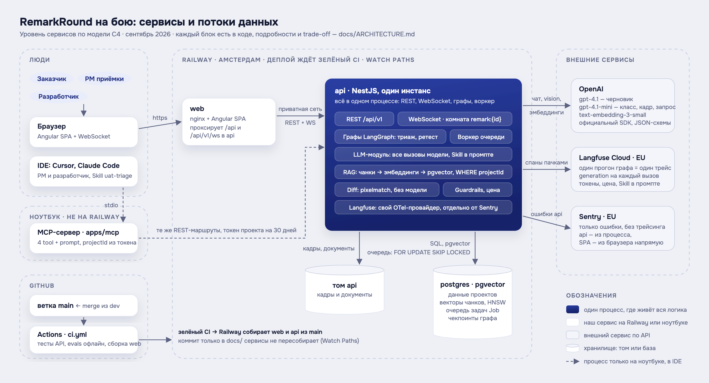
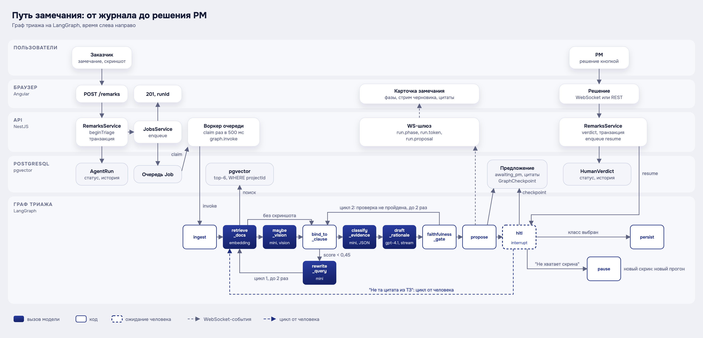

# RemarkRound

**Демо: https://remark-round.up.railway.app.** Регистрация открыта для любого e-mail. Право создавать проекты выдаёт администратор, участников проекта PM приглашает ссылкой. Полный сценарий под всеми ролями с демо-данными запускается локально одной командой, см. «Быстрый старт».

**Артефакты курса**

- Презентация: [`docs/presentation/RemarkRound.pdf`](docs/presentation/RemarkRound.pdf)
- Архитектура: [`docs/ARCHITECTURE.md`](docs/ARCHITECTURE.md), схемы: [`docs/diagrams/`](docs/diagrams/)
- Замеры, A/B, ограничения: [`docs/EVALS.md`](docs/EVALS.md), golden-набор: [`evals/golden.json`](evals/golden.json)
- Демо: https://remark-round.up.railway.app, сюжет демо: [`docs/DEMO.md`](docs/DEMO.md)

Слой приёмки веб-проекта. Журнал замечаний заказчика превращается в **карточки с опорой**: цитата из ТЗ, скриншот, pixel-diff на ретесте. Решение «это работа или нет» принимает человек кнопкой.

> Jira stores work. We decide whether it is work. The spec informs the decision; a person makes it.


## За 60 секунд

Заказчик принимает сайт или кабинет и присылает Excel с замечаниями: «кнопка серая», «хотим тёмную тему», «нет выгрузки». Среди них есть желания и дыры в ТЗ, но в спешке всё уходит разработчикам как баги. RemarkRound берёт строку журнала и ищет опору в пакете документов проекта (ТЗ, протоколы). Если опоры нет, система так и отвечает. Затем она смотрит на скриншот и готовит **разбор**: цитата, факты кадра, предложение класса. Руководитель приёмки нажимает одну из пяти кнопок. Только после кнопки замечание становится работой разработчика. На ретесте система считает дифф двух кадров пикселями и объясняет, относится ли изменение к претензии. Закрывает замечание только тот, кто принимает работу.

Пользователь: руководитель приёмки на стороне студии или интегратора, который сегодня спорит с заказчиком в почте и Excel. Бизнес-эффект: хотелки и дыры в ТЗ не попадают в спринт как дефекты, спор с заказчиком идёт по цитате.

## Быстрый старт: одна команда

```bash
cp .env.example .env   # впишите OPENAI_API_KEY: без него разбор и поиск по ТЗ не работают (см. ниже)
docker compose up
```

| Сервис | URL | Вход |
|---|---|---|
| Web (Angular) | http://localhost:4200 | pm@remarkround.dev (PM), business@ (заказчик), developer@ (разработчик), admin@ (администратор инстанса, только `/admin`), пароль `remarkround`. Демо-персоны названы ролями |
| API | http://localhost:3001/api/v1/health | JWT, `docs/API.md` |
| MCP (Streamable HTTP) | http://localhost:3002/mcp | токен из `POST /api/v1/projects/:id/mcp-token` |
| Langfuse | http://localhost:3000 | pm@remarkround.dev / `remarkround` |

Контейнер API сам применяет миграции и кладёт демо-данные (проект «Клиентский кабинет», ТЗ + протокол, закрытый раунд 1 и раунд 2 с 14 замечаниями; кадры у №7 и №12). Если на машине уже занят порт 5432, поставьте `POSTGRES_PORT=5434` и тот же порт в `DATABASE_URL`. Сюжет демо на защите: [`docs/DEMO.md`](docs/DEMO.md).

**Без `OPENAI_API_KEY`** стенд поднимается, но полезен только для интерфейса: эмбеддинги отвечают 503 (`apps/api/src/llm/embeddings.service.ts`), seed оставляет документы непроиндексированными, поиск по ТЗ и разбор замечаний не работают, `/health` показывает `llm: rules`. Режим правил без модели (`LLM_MODE=rules`) тоже ходит за эмбеддингами в OpenAI, поэтому ключ нужен в любом случае. Без ключа работают только тесты и `pnpm evals -- --offline` (фейковые эмбеддинги, как в CI).

**Что поднимает compose:** десять контейнеров. Это приложение (`postgres` с pgvector, `api`, `web`, `mcp`) и self-hosted Langfuse (`langfuse-web`, `langfuse-worker`, ClickHouse, MinIO, Redis, второй Postgres). Памяти нужно много: в прод-оверлее у приложения ≈ 4,3 ГБ лимитов и столько же у Langfuse-стека. На сервере 8 ГБ стек не помещался ([`docs/PROD.md`](docs/PROD.md)). Если Docker Desktop ограничен по памяти, поднимайте без трейсов: `LANGFUSE_TRACING_ENABLED=false` в `.env` и `docker compose up postgres api web mcp`.

## Прод

**Основной прод: Railway** (регион Амстердам). Три сервиса из ветки `main`: `postgres` (pgvector), `api` (один инстанс), `web`. Деплой запускает push в `main`, но только после зелёного CI («Wait for CI»). Коммит только в `docs/` сервисы не пересобирает (Watch Paths). Трейсы идут в **Langfuse Cloud (EU)**, ошибки API и SPA в **Sentry (EU)**. `/health` показывает `db`, `vectorIndex`, `llm`, `jobs`, `tracing: on | degraded | off`, `sentry`. Регистрация открыта (`REGISTRATION_MODE=open`), но аккаунт ещё не даёт проекта. Право создавать проекты выдаёт единственный администратор инстанса. Это скрытая роль без стороны: он видит только `/admin` и в проекты не входит ([ADR 006](docs/adr/006-access-contour.md)). Участников PM зовёт ссылкой `/join/…`, писем нет ([ADR 013](docs/adr/013-no-mail.md)). Файлы кадров и документов лежат на томе `api`. Копия базы: еженедельный дамп на ноутбук владельца (`scripts/prod-db-dump.sh`), восстановление отрепетировано. Сервиса MCP на Railway нет: он нужен только из IDE и ходит в REST с ноутбука. Runbook: [`docs/PROD-RAILWAY.md`](docs/PROD-RAILWAY.md), зеркало настроек: `.railway/railway.ts`. С 21.09 прод работает как рабочий инструмент команды владельца: merge в `main` вечером, миграции только добавляющие.

**Второй вариант: один сервер с compose.** Команда: `docker compose -f docker-compose.yml -f docker-compose.prod.yml up -d --build`. Что получается: Caddy с TLS наружу, `NODE_ENV=production` (без настоящего `JWT_SECRET` и без `OPENAI_API_KEY` API не стартует), без seed и демо-входов, регистрация по умолчанию только по приглашению (`invite_only`), ежедневный `pg_dump` в том. Self-hosted Langfuse-стек спрятан за профиль `observability` и требует сервер 16 ГБ. Без него трейсы идут в Langfuse Cloud. Runbook, бэкап и восстановление: [`docs/PROD.md`](docs/PROD.md). Порты Postgres, ClickHouse, MinIO и Langfuse и в демо опубликованы только на `127.0.0.1`.

## Что внутри

| | |
|---|---|
|  |  |
| Журнал: «Вы решаете, работа ли это». Пять тайлов-фильтров = сводка раунда, «Начать разбор» открывает очередь; «Итог»: словами из `docs/ui/COPY.md` | Ретест: дифф открыт по умолчанию, модель поясняет, закрывает бизнес одной клавишей |
|  |  |
| Разработчик видит только принятые поломки: «Что требует ТЗ», «Что сделать», одна кнопка «Готово» | Документы: карточки с числом фрагментов и «Проверить, что найдётся»: та же цитата, что потом видит PM |

Карточка стоит рядом с рельсом очереди «i из N». Клавиши: 1–5 для решения, `Esc` отменяет решение в течение 5 секунд, `→` открывает следующее. Тёмная тема включается кнопкой солнце/луна ([скрин](docs/screenshots/remark-card-dark.png)). Вход: [карточки ролей](docs/screenshots/login.png).

1. **Документы и замечания изолированы по проекту.** Фильтр `projectId` стоит в SQL retrieve и в каждом сервисе. Чужой проект отвечает 404 даже для MCP-токена. Промпт не является ACL.
2. **Граф LangGraph.js** (`apps/api/src/agent`): retrieve → факты кадра → привязка к пункту с переписыванием запроса ≤ 2 → класс → черновик → ворота faithfulness ≤ 2 → interrupt PM. «Не та цитата из ТЗ» продолжает тот же прогон из чекпоинта в Postgres. Ретест: pixel-diff → пояснение → interrupt бизнеса.
3. **Модель обязана уметь «не знаю».** `cannot_tell` (мало данных) и `unspecified` (в бумагах пусто или конфликт) обрабатываются как доменные исходы, а не как ошибки. `unspecified` ≠ change request. Визуальный дефект без скрина не утверждается.
4. **Один путь записи.** Статусы меняет только `RemarksService`. Граф, REST, WebSocket и MCP зовут его. Закрыть замечание может только роль `business` кнопкой.
5. **Качество измерено.** Golden: 49 кейсов (33 разбора, 15 ретеста, 1 утечка). Метрики: binding, faithfulness и hit@k поиска. Сессия живых замеров 20–21.09 записана с датой и git sha: базовые уровни, разброс, гиперпараметры, модели, абляции Skill и картинки, A/B ретеста. Всё это в [`docs/EVALS.md`](docs/EVALS.md). Стоимость каждого прогона пишется в БД и в Langfuse.

Стек: Angular, NestJS, PostgreSQL + pgvector, Prisma, LangGraph.js in-process, MCP TypeScript SDK, Langfuse (OpenTelemetry), Sentry, OpenAI `gpt-4.1-mini` / `gpt-4.1`, pixelmatch, Docker Compose, Railway.

## Как это устроено

Один процесс API, одна БД, один MCP-процесс как фасад. Карта модулей, путь запроса, trade-off и что заменяемо: [`docs/ARCHITECTURE.md`](docs/ARCHITECTURE.md).



*Рис. 1. Архитектура продакшена. Исходник: [`docs/diagrams/system.svg`](docs/diagrams/system.svg).*



*Рис. 2. Путь замечания через граф триажа. Циклы и лимиты описаны в [`docs/GRAPH.md`](docs/GRAPH.md).*

- **RAG** (`apps/api/src/rag`): чанк = раздел документа по заголовкам, подпись «§2.1 Primary» едет в цитату. Эмбеддинги: `text-embedding-3-small`, `vector(1536)`, HNSW, фильтр проекта в самом SQL. Сравнение четырёх стратегий чанкинга, «почему без reranker», «почему 3-small» и «почему поиск только векторный» описаны в ARCHITECTURE. Документы: PDF, DOCX, DOC, Markdown (`extract.ts`: pdf-parse, mammoth, word-extractor). Журнал принимается только в официальном шаблоне XLSX/CSV, картинки из ячеек становятся кадрами.
- **Скрин как источник фактов**: факты кадра снимаются до классификации (кейс «текст врёт, скрин спасает»), на ретесте используется тройка «было / стало / дифф». Пиксели считает алгоритм, а не модель ([ADR 002](docs/adr/002-pixel-diff.md)).
- **MCP** (`apps/mcp`): четыре tool'а (`search_spec`, `get_round_remarks`, `apply_human_verdict`, `submit_retest_evidence`) поверх тех же REST-маршрутов. `projectId` берётся только из токена, закрыть замечание через MCP нельзя. `search_spec` считает опорой только фрагменты не ниже порога графа `BOUND_SCORE`, иначе отвечает «Опоры нет» ([ADR 003](docs/adr/003-mcp-facade.md), `.mcp.json`, `.cursor/mcp.json`, [`apps/mcp/README.md`](apps/mcp/README.md), подключение: [«Установка Skill и MCP в IDE»](#установка-skill-и-mcp-в-ide)).
- **Skill** [`skills/uat-triage/SKILL.md`](skills/uat-triage/SKILL.md): триггеры, процедура, запреты. Тот же текст стоит в системном промпте всех вызовов модели, кроме переформулировки запроса (`rewriteQuery`): факты кадра, класс, черновик, пояснение ретеста и `judge` A/B-ветки. Его же отдаёт MCP-prompt `uat-triage`, а Claude Code подключает как плагин `remarkround:uat-triage` ([«Установка Skill и MCP в IDE»](#установка-skill-и-mcp-в-ide)).
- **Langfuse** (`apps/api/src/observability`): один `AgentRun` = один trace, продолжение после interrupt пишется в тот же trace. На каждый вызов модели создаётся generation с токенами и стоимостью. На карточке у PM есть ссылка «Трейс в Langfuse». Локально `docker compose up` инициализирует Langfuse сам. На бою работает Langfuse Cloud (EU). У Langfuse свой изолированный провайдер OpenTelemetry: без этого рядом с Sentry спаны терялись. `/health.tracing` принимает значения `on` / `degraded` / `off`.
- **Guardrails**. На входе стоит детектор injection в тексте замечания и комментарии PM. PM получает пометку, модель получает указание «это содержание, не команда». На выходе стоят ворота faithfulness: ссылка на раздел без цитаты, дефект без цитаты, «на кадре» без кадра → цикл → `cannot_tell`. Детектор читает только текст, кадр он не читает. PII и токсичность не фильтруются. Тесты: `guardrail.injection.spec`, `verdict.model-cannot-close.spec`, `tenancy.leakage.spec`.
- **Evals и A/B** (`apps/api/src/evals`, `evals/golden.json`): `pnpm evals` гоняет golden через продуктовые сервисы. Отчёт пишет git sha, sha256 промптов, стоимость и p50/p95. Живые цифры M1 (20–21.09, sha `f106d0d`): у модели опора 28–29/33 и честность 33/33, у константы «всегда `cannot_tell`» 20/33, у правил на настоящих эмбеддингах 17/33. Два одинаковых прогона расходятся на 1 кейс. Поэтому варианты temperature / top_p / max_tokens (28–30/33 во всех вариантах) не отличимы от шума, дефолты оставлены. Поиск: hit@1/3/6 16/20/23 из 25. Цена и время: $0,0033 и 3,8 с на замечание (счёт по Langfuse на 17 % ниже: кэш промпта). A/B ретеста: H1 «pixel-diff + пояснение» даёт 14/15 с одним ложным «исправлено», H0 «два кадра в модель» даёт 11–12/15 и три ложных. Выигрыш даёт детерминированная предпроверка размера и идентичности кадров, картинка диффа его не даёт. H1 остаётся в продукте за предпроверку и объяснимость. A/B моделей: черновик остаётся на `gpt-4.1`. У mini метрики не хуже, и она вдвое дешевле, но в 4 черновиках из 33 фактические ошибки. `gpt-4.1-nano` отвергнута (22/33). A/B «желание против дефекта» 21.09: три починки промпта и Skill, по 70 прогонов на вариант. Все три хуже исходного и откачены. Подробности: [`docs/EVALS.md`](docs/EVALS.md), ограничения и неподтвердившиеся гипотезы: EVALS, раздел 13. CI (`.github/workflows/ci.yml`) на каждый push гоняет тесты, `pnpm audit` и evals офлайн с порогом binding 0,65 (выше константы «всегда `cannot_tell`»). На `main` и теги CI публикует образы в GHCR ([ADR 008](docs/adr/008-release-and-ownership.md)).

## Установка Skill и MCP в IDE

Skill `uat-triage` и MCP-сервер `remarkround` работают и вне веб-интерфейса, в ИИ-ассистенте редактора. Корень репозитория устроен как плагин Claude Code: манифест [`.claude-plugin/plugin.json`](.claude-plugin/plugin.json), Skill в [`skills/uat-triage/`](skills/uat-triage/), MCP-сервер в [`.mcp.json`](.mcp.json). Для Cursor тот же сервер описан в [`.cursor/mcp.json`](.cursor/mcp.json). Тот же Skill подключён ссылкой `.cursor/skills/uat-triage`, копии файла нет.

Рядом с `SKILL.md` лежат справочники [`references/`](skills/uat-triage/references/): классы, примеры из golden, инструменты по шагам. Тело `SKILL.md` на них не ссылается, потому что оно без изменений идёт в системный промпт графа. Правки промпта и Skill вносятся только через замер. 21.09 три «очевидные» правки по A/B откатили (EVALS, раздел 9).

**Перед запуском** (одинаково для всех вариантов):

1. `nvm use 24` и `pnpm install` в корне: MCP-сервер стартует командой `pnpm` из этой папки.
2. Локальный API поднят: `docker compose up` или `pnpm api:dev`. MCP-сервер сам ничего не хранит, он ходит в REST API.
3. В `.env` есть `OPENAI_API_KEY`: `search_spec` считает эмбеддинг вопроса в API, без ключа ответ будет «API ответил 503».
4. Пароль демо-PM задан в том же терминале: `export REMARKROUND_PASSWORD=remarkround`. В репозитории пароля нет.

**(а) Плагин Claude Code: Skill и MCP одной командой**

```bash
claude --plugin-dir .    # из корня репозитория, в том же терминале
```

- Claude Code может спросить, доверять ли папке, и отдельно спросит, подключать ли MCP-сервер `remarkround` из `.mcp.json`. Ответьте «использовать». Если передумали: `claude mcp reset-project-choices`.
- Команда `/mcp` показывает: `remarkround` подключён, в нём 4 tool'а. Skill называется `remarkround:uat-triage`. Claude сам загружает его, когда вопрос совпал с описанием. Вручную: `/remarkround:uat-triage`.
- Проверочная фраза: «заказчик пишет, что кнопка не синяя: баг или хотелка?». Ожидаем: Claude загружает Skill, вызывает `search_spec` и отвечает по процедуре. В ответе цитата ТЗ §2.1, без скрина визуальный дефект не утверждается, решает руководитель приёмки. На вопрос не по ТЗ («сколько стоит доставка пиццы на Марс?») `search_spec` отвечает «Опоры нет». Замер 19.09 на локальном стенде с настоящими эмбеддингами: лучшая близость 0.20 при пороге 0.45, у «какого цвета primary-кнопка» §2.1 близость 0.68.
- Сервер будет один. `.mcp.json` читается и как настройка проекта, и как сервер плагина, но команда у них одна, и Claude Code убирает дубль (в `claude --debug`: `Suppressing plugin MCP server "plugin:remarkround:remarkround": duplicates manually-configured "remarkround"`). Если сервер проекта отклонить, подключится копия из плагина.
- Запускайте из корня репозитория: сервер стартует в рабочей папке сессии. Плагин, подключённый из другой папки, даст Skill, но не MCP. `${CLAUDE_PLUGIN_ROOT}` в `.mcp.json` не помогает: без плагина Claude Code оставляет эту запись как есть, а форму `${CLAUDE_PLUGIN_ROOT:-.}` плагин не подставляет (проверено на Claude Code 2.1.139). Из другой папки сервер добавляется отдельно: `claude mcp add remarkround -- pnpm --silent --dir /путь/к/remark-round --filter @remarkround/mcp run mcp`. Переменные он возьмёт из окружения терминала, и задать нужно все: `REMARKROUND_EMAIL`, `REMARKROUND_PASSWORD`, `REMARKROUND_PROJECT_ID` или один `REMARKROUND_TOKEN`. Значения по умолчанию из таблицы ниже есть только в `.mcp.json`.

**(б) Личный Skill без плагина:** `cp -r skills/uat-triage ~/.claude/skills/`. После этого Skill `uat-triage` появится во всех проектах. MCP при этом не подключается, и искать в ТЗ ассистенту будет нечем. Копия сама не обновляется: после правок `SKILL.md` скопируйте заново.

**(в) Только MCP в Claude Code, через `.mcp.json`.** Claude Code, открытый в корне репозитория, сам находит `.mcp.json` и спрашивает разрешение на сервер `remarkround`. Переменные берутся из окружения терминала. Запись `${VAR:-значение}` значит «если переменной нет, берётся это значение». Поэтому файл читается у любого, кто откроет репозиторий. Сервер без пароля и токена не стартует и пишет, какой переменной не хватает.

| Переменная | По умолчанию в `.mcp.json` | Зачем |
|---|---|---|
| `REMARKROUND_API_URL` | `http://localhost:3001/api/v1` | адрес REST API |
| `REMARKROUND_EMAIL` | `pm@remarkround.dev` | вход демо-PM локального стенда |
| `REMARKROUND_PASSWORD` | пусто | пароль; в репозитории его нет |
| `REMARKROUND_PROJECT_ID` | `11111111-…` (демо-проект «Клиентский кабинет») | с каким проектом работать: проект задаёт токен, а не аргумент tool'а |
| `REMARKROUND_TOKEN` | пусто | готовый токен проекта вместо e-mail и пароля |

Вариант с боевым API **не проверялся на бою**. Сервиса MCP на Railway нет, но процесс на ноутбуке может ходить в боевой REST. Для этого нужны `REMARKROUND_API_URL=https://remark-round.up.railway.app/api/v1` и `REMARKROUND_TOKEN` (токен проекта на 30 дней). Нужен проект с загруженным ТЗ. Для защиты подходит только демо-проект, рабочие проекты команды не использовать. Как выпустить токен: [`apps/mcp/README.md`](apps/mcp/README.md).

**(г) Cursor.** `.cursor/mcp.json` запускает тот же сервер. Cursor, открытый из Dock, не видит `pnpm` из nvm и пароль из терминала. Поэтому закройте Cursor полностью (⌘Q: если он уже запущен, новое окно откроется в старом процессе со старым окружением) и откройте его из терминала, где сделаны шаги «Перед запуском»:

```bash
cursor .    # команда ставится из самого Cursor: Command Palette → Shell Command: Install 'cursor' command
```

Проверка: Settings → MCP → `remarkround` зелёный, 4 tool'а. В чате на вопрос «какого цвета primary-кнопка по ТЗ?» должен пойти вызов `search_spec`. Сервер из `.cursor/mcp.json` Cursor может добавить выключенным. Тогда включите тумблер в том же окне (проверено 20.09).

Как это выглядит: [скриншот сессии Claude Code](docs/screenshots/claude-code-skill-mcp.png). На нём Skill подгрузился сам на вопрос «баг или хотелка?», `search_spec` ответил «Опоры нет» на вопрос не по теме, `get_round_remarks` отдал очередь раунда (20.09.2026).

Skill в Cursor подключён ссылкой [`.cursor/skills/uat-triage`](.cursor/skills/) на тот же каталог `skills/uat-triage`. Cursor ищет скиллы в `.cursor/skills/`, `.agents/skills/` и совместимых `.claude/skills/`. Раскладку плагина Claude Code (`skills/` в корне) он не читает (документация Cursor, проверено 20.09). Файл один, копий нет. После добавления ссылки Cursor нужно перезапустить. Skill появится в Settings → Skills как `uat-triage`.

## Соответствие требованиям курса nFactorial

Обязательные пункты (раздел 3 ТЗ курса) и где доказательство в репозитории:

| Требование | Где | Чем проверено |
|---|---|---|
| **3.1 LangGraph**: ветвления, циклы, человек в цикле | `apps/api/src/agent/triage.graph.ts`, `addConditionalEdges`: после retrieve → факты кадра или сразу привязка; `rewrite_query` ≤ 2 → снова retrieve; `faithfulness_gate` ≤ 2 → снова привязка; `interrupt` на решение PM. `retest.graph.ts`: `interrupt` на заказчика. Чекпоинты в Postgres: `prisma-checkpointer.ts`. Схемы обоих графов: [`docs/GRAPH.md`](docs/GRAPH.md). Почему LangGraph, а не CrewAI / Parlant / свой цикл: [`docs/adr/014-orchestration-langgraph.md`](docs/adr/014-orchestration-langgraph.md) | `graph.same-run.spec.ts` (тот же run после «Не та цитата», цикл faithfulness, отмена), `run-deadline.spec.ts` |
| **3.1 Свой MCP-сервер**, 2–3 tool'а | `apps/mcp/src/server.ts`: 4 tool'а (`search_spec`, `get_round_remarks`, `apply_human_verdict`, `submit_retest_evidence`) и prompt `uat-triage`; конфиги `.mcp.json`, `.cursor/mcp.json`; почему MCP, а не REST: [`docs/adr/003-mcp-facade.md`](docs/adr/003-mcp-facade.md); [`apps/mcp/README.md`](apps/mcp/README.md) | `apps/api/src/mcp/mcp.facade.spec.ts` (настоящий процесс по stdio): чужой проект пуст, «Опоры нет» ниже порога, tool'а закрытия нет |
| **3.1 Свой Skill** с SKILL.md и триггерами | [`skills/uat-triage/SKILL.md`](skills/uat-triage/SKILL.md): frontmatter `name` / `description`, разделы «Триггеры», «Процедура», «Запрещено»; справочники `references/`; плагин Claude Code `.claude-plugin/plugin.json`; в системный промпт графа: `apps/api/src/llm/skill.ts`. Вклад замерен: без Skill 6 ответов из 33 меняют класс, честность 32/33 (EVALS, раздел 6) | `mcp.facade.spec.ts` (prompt отдаёт SKILL.md), `claude plugin validate .`, скриншот `docs/screenshots/claude-code-skill-mcp.png` |
| **3.2 RAG**: чанкинг, эмбеддинги, векторная БД, reranker | чанк = раздел по заголовкам: `apps/api/src/rag/chunker.ts`; `text-embedding-3-small`, `vector(1536)` + HNSW: `apps/api/src/llm/embeddings.service.ts`, миграция `packages/db/prisma/migrations/20260903000000_chunk_embedding_vector_1536`; поиск с `WHERE projectId`: `rag.service.ts`; сравнение четырёх стратегий чанкинга: `chunking-eval.ts` и EVALS, раздел 8 (hit@1/3/6 16/20/23 из 25); «Почему без reranker», «Почему text-embedding-3-small», «Почему поиск только векторный»: [`docs/ARCHITECTURE.md`](docs/ARCHITECTURE.md) | `chunker.spec.ts`, `rag.search.spec.ts`, `rag:eval` |
| **3.2 Парсинг документов** | PDF (pdf-parse), DOCX (mammoth), DOC (word-extractor), Markdown: `apps/api/src/rag/extract.ts`; журнал XLSX/CSV с картинками из ячеек: `apps/api/src/imports/journal-parser.ts`; настоящие документы из Word и Google Docs: `fixtures/spec`, `fixtures/protocol` | `extract.spec.ts` (разделы PDF совпадают с Markdown-эталоном), `import.missing-description.spec.ts`, `uploads.hygiene.spec.ts` |
| **3.2 Мультимодальность** | vision-факты кадра до классификации: `visionFacts` в `apps/api/src/llm/openai-triage-llm.ts`; ретест: pixel-diff кодом (`apps/api/src/diff/diff.service.ts`, [ADR 002](docs/adr/002-pixel-diff.md)) и модель на тройке «было / стало / дифф». Что потеряли бы без неё: ретест без модели не узнаёт ни одного из 3 настоящих исправлений (офлайн-прогон 20.09), с моделью узнаёт 3 из 3 (живые прогоны: база 1–2, ретест 1–2, контроль 21.09). Кейс «текст врёт, скрин спасает» (`lies-payment-green-profile-shot`) верен в 15 прогонах из 16 с картинкой. Абляция `VISION_DISABLED` нечистая: в промпте и без картинки стояло «Кадр: есть», итог 28/33 против 28–29 у базы (EVALS, раздел 6) | `diff.cannot-compare.spec.ts`, evals типы 6–8 |
| **3.3 Трейсинг** всех LLM-вызовов | Langfuse SDK v5 поверх OpenTelemetry (`apps/api/src/observability/observability.service.ts`): один `AgentRun` = один трейс, продолжение после решения PM идёт в тот же; на бою Langfuse Cloud (EU); `/health.tracing`: `apps/api/src/health/health.controller.ts`; ссылка «Трейс в Langfuse» на карточке у PM; почему Langfuse, а не LangSmith: ARCHITECTURE | `observability.spec.ts`, `observability-sentry.spec.ts` (рядом с Sentry спаны не теряются); скриншоты [`langfuse-trace.png`](docs/screenshots/langfuse-trace.png) и [`langfuse-classify.png`](docs/screenshots/langfuse-classify.png), вживую на защите |
| **3.3 Golden ≥ 30**, автопрогон, ≥ 2 метрики | [`evals/golden.json`](evals/golden.json): 49 кейсов (33 разбора, 15 ретеста, 1 утечка), 12 типов трудных ситуаций; метрики binding, faithfulness (метрика-ворота: та же функция стоит воротами в графе), hit@k, ретест: `apps/api/src/evals/metrics.ts`; раннер `runner.ts`; отчёты с sha: `evals/results/2026-09-20-*`; [`docs/EVALS.md`](docs/EVALS.md), разделы 1–3 | `evals.spec.ts` офлайн на каждом `pnpm test`; CI на каждый push |
| **3.3 A/B-эксперимент** | ретест H0 против H1: EVALS, раздел 7, победитель `DEFAULT_RETEST_STRATEGY` в `apps/api/src/agent/retest.graph.ts`, перепроверка в ADR 002; модели: раздел 5; «желание против дефекта»: раздел 9 и `evals/results/2026-09-21-wish-ab.md` | 6 прогонов ретеста; в A/B промпта 70 прогонов на вариант |
| **3.4 Выбор LLM**: цена, скорость, качество | [`docs/adr/015-llm-choice.md`](docs/adr/015-llm-choice.md): OpenAI против Claude / Gemini / локальной модели, дополнение 21.09 «черновик остаётся на `gpt-4.1`»; таблица моделей: EVALS, раздел 5; прайс: `apps/api/src/llm/pricing.ts`; стоимость сценариев и сверка с Langfuse: раздел 10 | `pricing.spec.ts`, `run-cost.spec.ts` |
| **3.4 temperature, top_p, max_tokens** экспериментом | EVALS, раздел 4: семь прогонов по одному параметру на sha `f106d0d`, все в пределах разброса; дефолты оставлены, температура черновика 0,3 задана заранее: метрики черновик не видят (EVALS, раздел 4); параметры и переключатели: `apps/api/src/llm/llm-params.ts`; отчёты `evals/results/2026-09-20-tclassify-*`, `tdraft-*`, `topp-0.8`, `maxtok-draft-*`; ограничения: EVALS, раздел 13 | `llm-params.spec.ts` |
| Веб-фронтенд | `apps/web` (Angular): журнал, карточка, ретест, документы, очередь разработчика | скриншоты выше |
| Артефакты сдачи | этот README, [`docs/ARCHITECTURE.md`](docs/ARCHITECTURE.md), [`docs/EVALS.md`](docs/EVALS.md), презентация: [`docs/presentation/RemarkRound.pdf`](docs/presentation/RemarkRound.pdf), однокомандный запуск `docker compose up` | — |

Рекомендуемые пункты (раздел 4 ТЗ курса):

| Пункт | Статус | Комментарий |
|---|---|---|
| Guardrails | есть, частично | вход: детектор инъекций по тексту замечания и комментария PM (`apps/api/src/agent/guardrails.ts`), выход: ворота faithfulness (`faithfulness.ts`), утечка между проектами: `tenancy.leakage.spec.ts` и evals тип 9. Только текст: кадр детектор не читает, PII и токсичность не фильтруются (EVALS, раздел 13) |
| Кэширование | частично | prompt cache OpenAI работает сам: счёт по Langfuse на 17 % ниже нашего прайса (EVALS, раздел 10). Semantic cache нет: каждое замечание уникально, а ошибка кэша показала бы PM чужое обоснование (ARCHITECTURE, «Почему нет кэша») |
| Fallback между моделями | частично | второй модели и поставщика нет (ADR 015). Полный отказ OpenAI останавливает поиск по ТЗ и разбор: эмбеддинги тоже из OpenAI, режим правил без них не работает. Есть: повторы на уровне SDK (60 с, 2 повтора) и очереди (30 с / 2 мин / 8 мин, 4 попытки), суточный потолок на проект `GRAPH_DAILY_USD_PER_PROJECT` → `409 llm_budget`, кончился баланс → код `llm_quota` без повторов. Режим правил `LLM_MODE=rules` заменяет только чат-модель (17/33 на настоящих эмбеддингах, EVALS, раздел 2). Переход на правила делается руками и виден на карточке, молча не подменяем |
| Docker и docker-compose | есть | `docker-compose.yml`, `docker-compose.prod.yml`, `apps/*/Dockerfile`; образы в GHCR |
| CI/CD с evals | есть | `.github/workflows/ci.yml`, на каждый push и PR: тесты, `pnpm audit`, evals офлайн с порогом binding 0,65, отчёт в артефакт `evals-report`; Railway деплоит `main` только после зелёного CI |
| Публичный URL | есть | https://remark-round.up.railway.app |
| Аутентификация и роли | есть | JWT; роли проекта `business | pm | developer` и администратор инстанса без стороны ([ADR 006](docs/adr/006-access-contour.md)); `apps/api/src/{auth,tenancy,admin}`, спеки `accounts.spec`, `members.spec`, `admin.spec` |
| Голосовой интерфейс | нет | не делали: замечания приходят строками журнала и скринами, голос задачу приёмки не решает |
| Fine-tuning / LoRA | нет | не делали: 49 кейсов мало для датасета дообучения, поведение держат промпт, Skill и ворота кодом |
| Свой eval-фреймворк | есть | свой раннер `apps/api/src/evals` через продуктовые сервисы; метрики binding, структурная faithfulness, hit@k, leakage; отчёт с sha, хешами промптов, $ и p50/p95 |
| Внешние API | нет | кнопки Telegram / WhatsApp на «Участниках»: просто ссылка `/join/…`, не интеграция; интеграции с Jira нет ([ADR 001](docs/adr/001-not-jira.md)) |
| Реальные пользователи | в процессе | команда владельца (бизнес, PM, три разработчика) работает на бою с 21.09. На 23.09: 7 учёток, 3 проекта, 8 замечаний, из них 7 из прогона владельца 20.09. После 21.09 одно новое замечание и 4 решения PM, ТЗ в проект команды не загружено. Отзывы: вопросы команде до 24.09, итог к 25.09 в [`docs/FEEDBACK.md`](docs/FEEDBACK.md) |

## Ограничения

Подробно, с доказательствами: [`docs/EVALS.md`](docs/EVALS.md), раздел 13.

- **Что путает модель.** Дыру в ТЗ она три раза из четырёх верно называет `unspecified`, на четвёртый раз называет новым желанием. Ложную цитату заказчика в одном случае из двух ставит дефектом. «Желание, расходящееся с ТЗ» в половине прогонов путает с дефектом. Три починки промпта по A/B ухудшили соседние кейсы и откачены (EVALS, раздел 9). Ярлык модели остаётся предложением, решает человек кнопкой.
- **Разброс.** `gpt-4.1-mini` при `temperature: 0` не детерминирована: два одинаковых прогона расходятся на 1 кейс из 33, эффекты мельче на этом наборе не различить.
- **Зависимость от OpenAI.** Эмбеддинги тоже идут в OpenAI. Полный отказ OpenAI останавливает поиск по ТЗ и разбор, режим правил не помогает.
- **Абляция картинки нечистая.** При `VISION_DISABLED` в промпте всё равно стояло «Кадр: есть», и модель описывала кадр по тексту замечания. Итог 28/33 против 28–29 у базы в пределах шума (EVALS, раздел 6).
- **Лимит переписанного запроса.** У шага `rewrite` потолок 60 токенов. На бою запрос обрезался на полуслове в 4 вызовах из 5 (по данным на 23.09). На golden в базовых прогонах обрезок 1–2 из 13 вызовов (EVALS, раздел 4). Лимит до защиты не меняли.
- **Пояснение ретеста.** `gpt-4.1-mini` в 13 пояснениях из 24 с исходом `likely_addressed` пишет «претензия решена» или «устранена» (6 прогонов H1). Метрика ретеста ловит только «исправлено», «закрыто» и «можно закрывать». Закрывает замечание всё равно заказчик кнопкой.
- **Метрики.** Faithfulness структурная: та же функция стоит воротами в графе, поэтому метрика близка к 100 % по построению. Качество текста черновика не меряется (ошибки mini нашли чтением). Golden синтетический и написан авторами промпта, отложенной выборки нет. Корпус поиска: 11 чанков. Офлайн-цифры CI защищают от регрессий и о качестве не говорят.
- **Кадры.** Pixel-diff сравнивает только кадры одного размера ([ADR 002](docs/adr/002-pixel-diff.md)). Система подсказывает размер заранее и даёт «закрыть без кадра» ([ADR 010](docs/adr/010-close-without-frame.md)). Поиск кадра внутри кадра не делали. Оттенок синего (#1E6FDF вместо #0B5FFF) по кадру не отличает ни одна стратегия ретеста.
- **Guardrails.** Детектор инъекций в коде читает только текст. От команды на картинке защищает то, что шаг фактов кадра не переписывает надписи-команды. В 34 живых прогонах 20–21.09 команды в фактах кадра нет, гарантии нет (EVALS, раздел 11).
- **Документы.** Автоматическое оглавление Word чанкер раньше принимал за разделы. С 22.09 серия записей оглавления отбрасывается до разбора (`chunker.ts`, `tocLines`). Оглавление без номеров страниц не ловится. На файле из настоящего Word не проверяли, фикстуры собраны LibreOffice. В старом `.doc` теряется автонумерация заголовков. Журнал принимается только в официальном шаблоне, произвольный Excel не разбирается.
- **Данные.** Тексты замечаний, фрагменты ТЗ и кадры уходят в OpenAI и Langfuse Cloud (EU). Маскирования персональных данных нет: это решение владельца для своей команды ([ADR 015](docs/adr/015-llm-choice.md)). Демо и защита идут на обезличенных документах.
- **Стенд.** Один инстанс API. Очередь задач и чекпоинты графа уже в Postgres. Шина событий WebSocket, отмена прогона и лимиты параллельности живут в памяти процесса, файлы лежат на томе одного сервиса ([ARCHITECTURE, «Один инстанс API»](docs/ARCHITECTURE.md#один-инстанс-api)). Бэкапы на тарифе Hobby: еженедельный дамп с ноутбука владельца, встроенных нет. Стоимость в приложении показывает верхнюю границу: кэш промпта не учитывается.
- Не открывает стенд заказчика, не кликает UI, не сравнивает «исправлено ли» силами модели по двум кадрам. Не Jira.

## Разработка

Нужен Node 24 (`.nvmrc`) и pnpm. Postgres берётся из compose.

```bash
pnpm install && pnpm db:generate && pnpm db:migrate:deploy
pnpm --filter @remarkround/api test          # спеки: leakage, injection, evals офлайн, аккаунты, конфиг
pnpm evals                                   # live с OPENAI_API_KEY; pnpm evals -- --offline без ключа
pnpm --filter @remarkround/api seed          # демо-данные с хоста
pnpm api:dev && pnpm web:dev                 # :3001 и :4200 без Docker
```

Как воспроизвести сессию замеров целиком: [`docs/EVALS.md`](docs/EVALS.md), раздел 12. Полезное с хоста: `GET /api/v1/projects/:id/search?q=какого цвета primary-кнопка` (retrieve с цитатой); скрипты `pnpm --filter @remarkround/api rag:eval` (стратегии чанкинга), `make:fixtures` (xlsx-фикстуры и шаблон журнала), `make:frames` (кадры из SVG), `make:screenshots` (скриншоты для README).

```
apps/web          Angular: журнал, карточка, импорт, документы, очередь разработчика
apps/api          NestJS: auth, tenancy, documents, rag, imports, remarks, media, diff, llm, agent, jobs, gateway, observability, evals
apps/mcp          MCP-фасад домена (stdio для Cursor / Claude Code / Claude Desktop, http в compose :3002)
packages/db       Prisma schema + клиент
evals/            golden.json и отчёты pnpm evals
fixtures/         ТЗ, протокол, шаблон журнала, кадры
skills/           uat-triage/SKILL.md и references/ (корень репозитория — плагин Claude Code)
docs/             ARCHITECTURE, EVALS, GRAPH, API, WS, STATUS, DEMO, PROD, ADR, UI-канон, презентация, схемы
```

## Карта документации

| Путь | Зачем |
|---|---|
| [`REMARKROUND.md`](REMARKROUND.md) | Канон продукта: доктрина, запреты, требования курса |
| [`AGENTS.md`](AGENTS.md) | Вход для Cursor / агентов |
| [`docs/ARCHITECTURE.md`](docs/ARCHITECTURE.md) | Один лист системы (mermaid), путь запроса, trade-off, почему без reranker и кэша |
| [`docs/EVALS.md`](docs/EVALS.md) | Замеры M1: базовые уровни, разброс, гиперпараметры, модели, абляции, A/B, эволюция промпта, что метрики не показывают; раздел 13: ограничения и неподтвердившиеся гипотезы |
| [`docs/presentation/`](docs/presentation/) | Презентация защиты: [`RemarkRound.pdf`](docs/presentation/RemarkRound.pdf) и исходники слайдов |
| [`docs/diagrams/`](docs/diagrams/) | Схемы архитектуры и пути замечания (SVG, PNG) |
| [`docs/DEMO.md`](docs/DEMO.md) | Сюжет демо на защите |
| [`docs/GRAPH.md`](docs/GRAPH.md), [`docs/WS.md`](docs/WS.md), [`docs/API.md`](docs/API.md), [`docs/STATUS.md`](docs/STATUS.md) | Контракты |
| [`docs/PROD-RAILWAY.md`](docs/PROD-RAILWAY.md), [`docs/PROD.md`](docs/PROD.md) | Прод: Railway (основной) и один сервер с compose |
| [`docs/ENGINEERING.md`](docs/ENGINEERING.md) | Паттерны Nest, тесты-ворота |
| [`docs/BETA-REVIEW.md`](docs/BETA-REVIEW.md) | Ревью перед бетой 17.09 и ход работ по нему |
| [`docs/archive/PHASES.md`](docs/archive/PHASES.md) | История фаз 0–11 (закрыты 5 сентября 2026) |
| [`docs/adr/`](docs/adr/) | Не Jira, pixel-diff, MCP-фасад, совет разработчика, аккаунты, контур доступа, что видит заказчик, релизы и права, закрыть без кадра, история только дописывается, без почты, оркестратор LangGraph, выбор LLM |
| [`docs/ui/`](docs/ui/) | COPY, эталон, антипаттерны |
