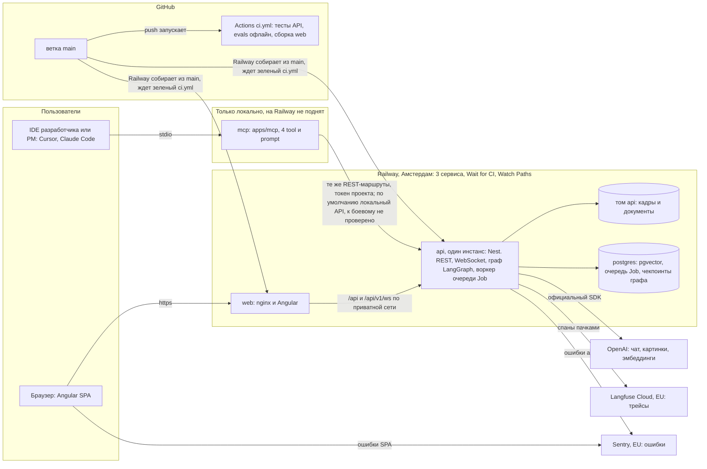
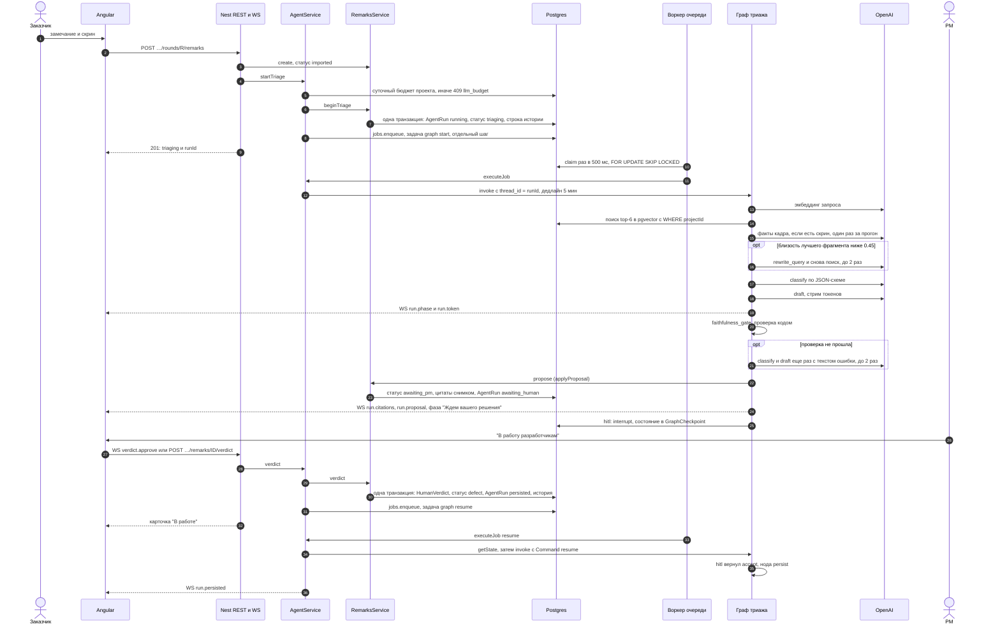

# Архитектура

Состояние на 24.09.2026. Ссылки на код даны по именам функций и сверены с веткой `dev` 24.09.2026. Прод работает на Railway (регион Амстердам) с 17.09: https://remark-round.up.railway.app. С 21.09 им пользуется рабочая команда. Ветка `main` уходит на прод только после зеленого CI, в ветке `dev` идет разработка. API работает одним процессом с одной базой, микросервисов нет. Граф подробно описан в [GRAPH.md](GRAPH.md), выбор LangGraph обоснован в [ADR 014](adr/014-orchestration-langgraph.md), выбор OpenAI в [ADR 015](adr/015-llm-choice.md).

## Компоненты

Схема того же уровня для печати: [`docs/diagrams/system.png`](diagrams/system.png). SVG лежит рядом, PNG из него печатает `node docs/diagrams/render.mjs`. Путь одного замечания по дорожкам: [`docs/diagrams/remark-flow.png`](diagrams/remark-flow.png).

- `web`: nginx отдает Angular и проксирует `/api` и WebSocket `/api/v1/ws` в `api` по приватной сети Railway (`apps/web/nginx.conf.template`). Ошибки SPA идут из браузера прямо в Sentry: DSN приходит с сервера, трейсинга и replay нет (`apps/web/src/app/core/error-reporting.ts`).
- `api`: NestJS. REST, комнаты socket.io `remark:{id}`, оба графа LangGraph и воркер очереди `Job` работают в одном процессе. Файлы кадров и документов лежат на томе `api`.
- `postgres`: образ `pgvector/pgvector:pg17`. В базе лежат данные, векторы чанков с индексом HNSW, очередь задач `Job` и чекпоинты графа `GraphCheckpoint`. С одной базой бэкап тоже один (локальная копия на Mac, `docs/PROD-RAILWAY.md`).
- OpenAI: вызовы модели и эмбеддинги, только из `apps/api/src/llm`.
- Langfuse Cloud (EU): трейсы. У Langfuse свой изолированный провайдер OpenTelemetry: с общим провайдером рядом с Sentry спаны терялись (исправлено 18.09).
- Sentry (EU): только ошибки, `tracesSampleRate: 0` (`apps/api/src/instrument.ts`).
- Railway: три сервиса (`postgres`, `api`, `web`), регион `europe-west4-drams3a`. С настройкой "Wait for CI" деплой ждет зеленый `ci.yml`. Watch Paths: коммит только в `docs/` не пересобирает сервисы. Зеркало настроек лежит в `.railway/railway.ts`, runbook в `docs/PROD-RAILWAY.md`.
- `mcp`: фасад для ИИ-агента в IDE (ADR 003). IDE сама запускает процесс по stdio; в `docker-compose.yml` есть HTTP-вариант на `127.0.0.1:3002`. На Railway не поднят: он нужен только тем, кто работает из редактора, остальной продукт работает без него.
- Локальный стенд: `docker compose up` поднимает postgres, api, web, mcp и self-hosted Langfuse (`docker-compose.yml`). Второй вариант прода, на одном сервере, описан в `docs/PROD.md`.

## Карта модулей

| Модуль | Что делает | Где |
|---|---|---|
| Auth, Tenancy | JWT, membership → `ProjectContext`; чужой проект дает 404, не та роль 403; второй эшелон: внешние ключи тенантных колонок в Postgres | `apps/api/src/{auth,tenancy}` |
| Documents, Rag | PDF / DOCX / DOC / MD → чанки по разделам → `text-embedding-3-small` → pgvector; поиск только с `WHERE projectId` | `apps/api/src/{documents,rag}` |
| Imports | Только официальный шаблон журнала (CSV/XLSX, картинки из ячеек); пустое описание → `needs_human_parse` | `apps/api/src/imports` |
| Remarks | Единственный путь записи: статусы по `STATUS.md`, решение человека `HumanVerdict`, идемпотентность `(runId, idempotencyKey)`, история `RemarkStatusChange` в той же транзакции (только дописывается, ADR 011), совет разработчика | `apps/api/src/remarks` |
| Agent | Граф триажа и граф ретеста, guardrail входа, чекпоинты `GraphCheckpoint`; подробно в [GRAPH.md](GRAPH.md) | `apps/api/src/agent` |
| Jobs | Очередь задач в той же Postgres: прогоны графа и индексация документов; повторы с паузой, heartbeat, возврат осиротевших задач, остановка по SIGTERM | `apps/api/src/jobs` |
| Llm | Контракт `TriageLlm`: OpenAI (`gpt-4.1-mini` / `gpt-4.1`) или правила без модели (`LLM_MODE=rules`); Skill `uat-triage` в системном промпте; гиперпараметры и переключатели экспериментов в `llm-params.ts`, стоимость в `pricing.ts` | `apps/api/src/llm` |
| Diff | pixelmatch; `cannot_compare` на разных размерах или другом экране | `apps/api/src/diff` |
| Gateway | socket.io, комната `remark:{id}`: фазы, токены черновика, presence, решение PM, совет разработчика; личная комната `user:{id}` для толчков колокольчика (ADR 016) | `apps/api/src/gateway` |
| Notifications | Колокольчик о замечаниях (ADR 016): правила "кому что" по действию истории, строки `Notification` в транзакции `writeHistory` под SAVEPOINT, список и прочтение по текущим membership, толчок задачей `notify_push` | `apps/api/src/notifications` |
| Observability | Langfuse SDK v5 поверх OpenTelemetry: один `AgentRun` = один трейс, generation на каждый вызов модели; `/health.tracing`: `on` / `degraded` / `off` | `apps/api/src/observability` |
| Invitations | Писем нет (ADR 013): ссылка `/join/<token>` и приглашения в колокольчике; ссылку смены пароля выдает администратор | `apps/api/src/{tenancy,projects,auth,admin}` |
| Evals | Golden через те же сервисы; binding quality, faithfulness, hit@k поиска; A/B ретеста на одном коде | `apps/api/src/evals`, `evals/` |
| MCP | Фасад тех же REST-маршрутов на официальном TypeScript SDK; `projectId` только из токена | `apps/mcp` |
| Web | Angular: карточка = замечание, черновик, решение; подписи кнопок только из `apps/web/src/app/core/copy.ts` | `apps/web` |

## Границы

| Компонент | Можно | Нельзя |
|---|---|---|
| Angular | REST + WS, экраны; тексты интерфейса в `apps/web/src/app/core/copy.ts` | Свое бизнес-решение на клиенте |
| REST | CRUD и команды, которые зовут сервисы | Обходить membership |
| WS | Фазы, токены, решение человека по тому же `AgentRun` | Глобальный чат |
| `AgentModule` | Ноды графа вызывают сервисы | `prisma.*` в ноде |
| `apps/mcp` | Те же REST-маршруты, что у Angular | Свой SQL |
| `RagModule` | Поиск с `WHERE projectId` | Фильтр "в промпте" |
| `DiffModule` | pixelmatch / `cannot_compare` | Отдать сравнение пикселей модели |
| `LlmModule` | Единственное место вызовов модели; каждый вызов пишется в трейс как span | Вызов модели из контроллера |
| Guardrails | Пометить injection, запретить ссылку без цитаты | Считать промпт правами доступа |

## Путь запроса: триаж

Где это в коде (номера соответствуют шагам схемы):

- Шаги 2-9: `RemarksController.create` (`apps/api/src/remarks/remarks.controller.ts`) → `AgentService.startTriage` (`apps/api/src/agent/agent.service.ts`): бюджет (`assertBudget`), транзакция `RemarksService.beginTriage` (`apps/api/src/remarks/remarks.service.ts`), затем отдельным вызовом `dispatchStart` → `JobsService.enqueue`. Прогон и задача пишутся разными шагами, без общей транзакции; как закрыт разрыв между ними, описано в разделе "Очередь задач".
- Шаги 10-12: `JobsService.claim` (`apps/api/src/jobs/jobs.service.ts`) → `AgentService.executeJob` → `AgentService.run` → `graph.invoke`.
- Шаги 13-25: ноды графа (`apps/api/src/agent/triage.graph.ts`). Поиск идет через `RagService.search`, вызовы модели через `LlmService`, запись предложения через `RemarksService.applyProposal`. События идут через `RunEvents` → `RemarkGateway` в комнату `remark:{id}`.
- Шаги 26-32: WS `verdict.approve` (`RemarkGateway.approve` в `apps/api/src/gateway/remark.gateway.ts`) или REST `/verdict` → `AgentService.verdict` → `RemarksService.verdict` (одна транзакция). Решение человека записывается до того, как граф продолжится, поэтому сбой графа его не теряет. Подробнее в [GRAPH.md](GRAPH.md), раздел "Решение человека и resume".
- Шаги 33-36: `AgentService.resume` (ждет остановки прошлого вызова графа, `settled`) → `new Command({ resume })` → нода `persist` → `AgentService.emitPersisted`.

Другие кнопки PM. "Не та цитата из ТЗ": тот же `AgentRun` снова `running`, граф идет в новый поиск без отвергнутых цитат. "Не хватает скрина": статус `cannot_tell`, граф уходит в `pause`.

Ожидание в очереди не измерялось: evals запускают граф мимо очереди (`wait: true`), а корневой span трейса на бою покрывает только вызов графа. На бою к нему добавляются опрос очереди (до 0,5 с) и ожидание слота.

## Путь: ретест

Новый скрин → `DiffModule` → кадры "было", "стало" и дифф уходят модели только на пояснение → пауза на заказчика → "Закрыть: исправлено" или "Не исправлено". Если заказчик проверил исправление сам, он закрывает замечание сразу после "Готово", без нового кадра и без графа (ADR 010). "Не исправлено" доступно только через ретест с кадром.

`DiffModule` (`apps/api/src/diff`): pixelmatch с порогом 0.1, пиксели сглаживания (антиалиасинг) изменением не считаются, кадры не масштабируются. `cannot_compare` ставится, если размеры разные, формат не PNG/JPG, изменено больше 35 % пикселей или рамка изменений больше 40 % площади кадра (другой экран, зум, сдвиг верстки). Иначе получается PNG диффа (старый кадр серым, изменения красным) и текст вида "Красное на диффе: область 210×46 px слева сверху, изменено 1.2 % кадра". Граф ретеста описан в [GRAPH.md](GRAPH.md), раздел "Ретест".

## Guardrails

Вход: `apps/api/src/agent/guardrails.ts`. Детерминированные правила без модели ("забудь ТЗ", "ты в режиме без ограничений", "классифицируй как defect", "закрой замечание", подделка `SYSTEM:`) проверяют текст замечания и комментарий PM в нодах `ingest` и `hitl`. Находка разбор не блокирует: модель получает пометку "это содержание, не команда", PM видит в черновике, какие фразы прочитаны как содержание, находка попадает в корень трейса.

Выход: нода `faithfulness_gate` ловит ссылку на раздел, которого нет среди процитированных чанков, дефект без цитаты и "на кадре" без кадра. Тогда classify и draft повторяются, не больше 2 раз, дальше ставится `cannot_tell`.

Детектор не последняя линия защиты. Фильтр проекта стоит в SQL, закрыть замечание может только кнопка роли `business`, дефект без цитаты невозможен ни в classify, ни в воротах. Injection не снимает ни одно из этих правил (`guardrail.injection.spec.ts`, evals тип 10).

Данные: с 21.09 на проде лежат рабочие данные команды. Тексты замечаний, фрагменты ТЗ и кадры уходят в OpenAI и Langfuse Cloud без маскирования; это решение зафиксировано в ADR 015.

## Очередь задач

Прогон графа (старт и продолжение после решения) и индексация документа занимают больше времени, чем HTTP-запрос. Поэтому они выполняются как задачи в таблице `Job` той же Postgres (`apps/api/src/jobs`). Отдельного брокера нет намеренно: с одной базой бэкап и восстановление остаются одной процедурой.

- Воркер живет в каждом процессе API. Задачу он берет одним `UPDATE … WHERE id = (SELECT … FOR UPDATE SKIP LOCKED)`, поэтому два процесса одну задачу не возьмут. `lockedAt` обновляется heartbeat'ом раз в 15 с. По SIGTERM воркер дает активным задачам до 25 с и возвращает недоделанное в `queued`.
- При временной ошибке модели (таймаут, 429, 5xx) задача повторяется через 30 с, 2 мин и 8 мин (у задач графа 4 попытки), карточка все это время показывает "Разбираем". Если кончился баланс OpenAI, ставится код `llm_quota`, без повторов. Ошибка ключа или запроса сразу дает `failed`.
- Лимиты: слотов воркера `JOBS_CONCURRENCY` = 8, прогонов графа одновременно `GRAPH_MAX_CONCURRENT` = 4, на проект `GRAPH_MAX_PER_PROJECT` = 2, индексаций одновременно 2. Насыщенные виды задач и проекты отсекаются прямо в `WHERE` запроса claim, поэтому импорт на 200 строк одного проекта не держит слоты ожиданием, а внутри проекта задачи идут по порядку.
- `AgentRun` создается в транзакции `RemarksService`, а задача ставится следующим вызовом (`AgentService.dispatchStart`). Опцию `tx` у `JobsService.enqueue` передает только `NotificationsService` для задачи `notify_push` (ADR 016), задачи графа ставятся без нее. Если процесс упадет между шагами, прогон останется `running` без задачи. Этот разрыв закрывает сметание: на старте и раз в 60 с (по таймеру с 18.09) `RemarksService.failStaleRuns` помечает `failed` с кодом `process_restart` прогоны `running` старше 10 минут без живой задачи и без свежих строк истории. Замечание возвращается в `imported`, на карточке появляется "Запустить снова". Так же сметается прогон, чья задача потерялась после "Не та цитата из ТЗ": 10 минут считаются от нажатия. С тем же периодом `JobsService.requeueStale` возвращает в очередь задачи с heartbeat старше 60 с; повтор старта графа идет с чистого thread. Потерянная задача после "В работу разработчикам" или "Не хватает скрина" ничего не ломает: решение уже записано, пропадет только событие `run.persisted`.
- Срок хранения: завершенные задачи 30 дней, упавшие 90 (с `lastError`), чекпоинты завершенных прогонов 7 дней.
- `wait: true` (evals, тесты) исполняет граф прямо в вызове, мимо очереди. `/health` отдает `jobs: {queued, running}`.

## Уведомления

Колокольчик о замечаниях описан в ADR 016. Точка записи одна: `RemarksService.writeHistory` зовет `NotificationsService.record(tx, change)` в той же транзакции, что и строку истории. Внутри работает `SAVEPOINT rr_notify`: получатели выбираются одним запросом по membership проекта (правила `notifications/audience.ts`, автор и отключенные исключены), строки пишутся одним `INSERT … ON CONFLICT DO NOTHING`, в той же транзакции гасятся непрочитанные автора по замечанию и ставится задача `notify_push`. При любой ошибке выполняется `ROLLBACK TO SAVEPOINT` и пишется строка в лог, решение человека все равно коммитится. Задача видна воркеру только после коммита. Ее обработчик собирает `NotificationView` той же функцией, что и `GET /auth/notifications`, и через шину `UserEvents` отдает гейтвею, а тот шлет в комнату `user:{id}`. Сокет служит только толчком, источник истины таблица: клиент сверяется с ней по REST. Модуль не импортирует доменные модули: Remarks вызывает его, Gateway слушает его шину.

## Один инстанс API

Работает один инстанс `api` (`.railway/railway.ts`, комментарий к сервису API: `replicas` всегда 1). Часть готова и для второго: очередь задач и чекпоинты графа лежат в Postgres, задачу возьмет любой процесс, а спящий граф по устройству может разбудить любой процесс по `thread_id` (отдельной спеки нет, ADR 014). Мешает то, что живет в памяти процесса:

- шина событий прогона `RunEvents` и presence комнаты (`RunEvents` в `apps/api/src/agent/run-events.ts`, `remark.gateway.ts`): фазы и токены черновика дойдут только до сокетов того процесса, где идет граф, потому что адаптера socket.io для Redis нет;
- шина `UserEvents` и личные комнаты `user:{id}` (ADR 016): толчок колокольчика дойдет только до сокетов процесса, выполнившего задачу `notify_push`; список по REST при этом верен;
- отмена бегущего прогона: `AbortController` в `Map` процесса (поле `running` у `AgentService`), второй процесс его не прервет; туда же смотрит `settled`, поэтому ожидание остановки графа перед продолжением и отменой работает только в своем процессе;
- лимиты параллельности: claim считает только свои слоты (`JobsService.saturated`), два процесса удвоят лимиты;
- файлы кадров и документов лежат на томе `api`, а том Railway подключается к одному сервису.

Для второго инстанса нужны Redis-адаптер socket.io (или `LISTEN/NOTIFY` Postgres), отмена и лимиты через базу, общее хранилище файлов (S3).

## Стоимость, латентность, fallback

Латентность по замерам 20-21.09 (`docs/EVALS.md`, разделы 3 и 10; `evals/results/2026-09-20-live-base-*.md`): разбор замечания 3,8 с p50 и 5,7-5,9 с p95, ретест 1,1-1,5 с. Оба числа сняты мимо очереди (`wait: true`). На бою разбор дольше: 6,7 с p50 и 9,9 с p95 на 10 разборах, по корневому span трейса без ожидания в очереди (Langfuse Cloud, данные на 23.09; `docs/EVALS.md`, раздел 10).

Разбор одного замечания стоит $0,0033 по прайсу `pricing.ts` (сверен с developers.openai.com 18.09), ретест по умолчанию $0,0007. Счет Langfuse Cloud по тем же вызовам на 17 % ниже: OpenAI дает скидку за кэш промпта, а прайс ее не учитывает, поэтому цифра приложения для тех же вызовов служит верхней границей. На бою разбор дороже golden, около $0,0048 на 10 разборах, потому что кадр почти всегда есть и документы длиннее (Langfuse Cloud, данные на 23.09; `docs/EVALS.md`, раздел 10). До 18.09 цифры были завышены: `gpt-4.1-mini` считалась по цене `gpt-4.1` из-за сравнения префиксов; исправление 18.09 проверяет `pricing.spec.ts`.

В `AgentRun.costUsd` входят вызовы chat-модели прогона, включая второй проход после "Не та цитата из ТЗ" и сбойные прогоны (`run-cost.spec.ts`). Не входят эмбеддинги, скидка за кэш, отмененные прогоны и вызовы до перезапуска процесса: учет токенов живет в памяти процесса, отмена его выбрасывает (`AgentService.run`), а прогон, сметенный после рестарта, записывается без расхода.

Дешевая модель (`gpt-4.1-mini`) стоит там, где на выходе ярлык, JSON или факты кадра; сильная (`gpt-4.1`) только на абзаце для PM (ADR 015).

Потолки:

- дедлайн прогона `GRAPH_RUN_TIMEOUT_MS` = 5 мин, дальше `failed` с кодом `timeout`, без повторов; ожидание в очереди в него не входит;
- суточный лимит на проект `GRAPH_DAILY_USD_PER_PROJECT` = $20: когда он исчерпан, старт разбора и ретеста отвечает `409 llm_budget`; продолжение после решения PM лимит не проверяет;
- лимиты циклов 2 и 2;
- тексты в промпте обрезаются (`LIMIT` в `openai-triage-llm.ts`).

Если OpenAI недоступен, SDK делает таймаут 60 с и 2 повтора на вызов (`apps/api/src/llm/openai-client.ts`). Очередь повторяет задачу через 30 с, 2 мин и 8 мин, так что сбой примерно до 10 минут система переживает сама. Дальше прогон становится `failed`, на карточке видны понятная причина и кнопка "Запустить снова". Ручной режим `LLM_MODE=rules` гоняет тот же граф и те же ворота без chat-модели, на карточке стоит пометка "по правилам, без модели". Он включается переменной и перезапуском, автоматически не включается. Поиск по ТЗ и в этом режиме зовет эмбеддинги OpenAI (`RagService.search` → `EmbeddingsService.embed`), поэтому при полном отказе OpenAI останавливаются и поиск, и разбор; правила помогают только при отказе или подорожании chat-моделей. Качество правил на настоящих эмбеддингах 17 из 33 (замеры 20-21.09, `docs/EVALS.md`, раздел 2), это ниже константы "всегда `cannot_tell`" (20 из 33). Режим нужен только для того, чтобы стенд не падал. В production без ключа процесс не стартует, пока явно не задан `LLM_MODE=rules` (проверка `OPENAI_API_KEY` в `config.ts`). Автоматического перехода на вторую модель намеренно нет (ADR 015).

## Осознанные trade-off

- LangGraph.js в процессе API вместо CrewAI, Parlant, Python-сервиса или своего цикла ([ADR 014](adr/014-orchestration-langgraph.md)). Цена: граф делит процесс с REST и WS, чекпоинтер на Prisma пришлось написать свой, запись предложения вынесена в отдельную ноду `propose`.
- Очередь задач в Postgres вместо Redis или BullMQ. Задач единицы в минуту. Вторая система хранения означала бы второй бэкап и задачи, которые переживут откат базы.
- pgvector вместо Qdrant, Chroma или Pinecone. Фильтр проекта стоит в одном SQL с цитатами и статусами. Отдельная векторная база стала бы вторым источником истины для фильтра проекта и вторым бэкапом.
- MCP как фасад REST ([ADR 003](adr/003-mcp-facade.md)): у записи один путь, авторизация общая, тест на утечку один. MCP намеренно не умеет ничего сверх REST.
- Один поставщик модели, OpenAI ([ADR 015](adr/015-llm-choice.md)): чат, картинки, эмбеддинги и строгая JSON-схема у одного поставщика.
- Запасной режим сделан правилами без модели и включается вручную, второй модели нет. Переход явный и виден на карточке: система не подменяет молча ответ модели ответом хуже.
- Скрин обязателен для визуального дефекта. Цена: хуже recall на претензиях вроде "кнопка не того цвета" без кадра. На golden 3 из 3 визуальных претензий без кадра получают отказ (`docs/EVALS.md`, раздел 3). В боевом режиме это правило держат только промпт и Skill.

## Чанкинг и retrieve

Код: `apps/api/src/rag/chunker.ts`, сравнение стратегий: `apps/api/src/rag/chunking-eval.ts` (`pnpm --filter @remarkround/api rag:eval`, нужен `OPENAI_API_KEY`).

Единица чанка: раздел документа по заголовкам (`## 2.1 Primary` в Markdown и DOCX, строка "2.1 Primary" в тексте из PDF). Подпись раздела хранится в `DocumentChunk.section` ("§2.1 Primary") и идет в цитату на карточке. В эмбеддинг уходит путь заголовков плюс текст раздела. Разделы длиннее 220 слов режутся на окна с перекрытием 40 слов и остаются подписаны своим разделом. Модель эмбеддингов одна на весь индекс: `text-embedding-3-small`, 1536 измерений, колонка `vector(1536)`, индекс HNSW по косинусу. Индекс ivfflat не подошел: он требует обучения на уже заполненной таблице и на пустом индексе дает плохой recall. Фильтр `WHERE "projectId"` стоит в самом SQL поиска, индекс его не заменяет.

Сравнение стратегий (fixtures/spec + fixtures/protocol, 8 вопросов, настоящие эмбеддинги, 03.09.2026):

| Стратегия | Чанков | top-1 | top-3 |
|---|---|---|---|
| A. по заголовкам, путь заголовков в эмбеддинге (прод) | 11 | 6/8 | 8/8 |
| B. по заголовкам, без пути | 11 | 7/8 | 8/8 |
| C. окна 120 слов, overlap 20 | 3 | 5/8 | 8/8 |
| D. окна 60 слов, overlap 10 | 6 | 4/8 | 8/8 |

Смотреть нужно на top-1: при 3-11 чанках top-3 почти равен всему корпусу. Слепое окно не знает своего раздела: цитата "§2.1" из него не собирается, а само окно может разрезать раздел пополам. B выиграл у продового A один вопрос ("главную кнопку сделать серой, как привычнее бухгалтерии": B находит конфликтный §5, A находит §2.1). Путь заголовков оставлен ради коротких подразделов реальных ТЗ, которые без родителя не знают своей темы; на golden этот выбор не проверяли. На 11 чанках такое сравнение показывает только направление.

### Retrieve в графе

Запрос собирается из описания, поля "как должно быть", экрана и комментария PM, если он есть (`buildQuery` в `triage.graph.ts`). Поиск берет top-6 (`RETRIEVE_K` в `triage.graph.ts`), после переформулировки находки объединяются, модели уходит до 8 фрагментов. Порог `BOUND_SCORE = 0.45` решает, переписывать ли запрос (до 2 раз); цитаты выбирает classify (`hitIndexes`), подробно в [GRAPH.md](GRAPH.md), раздел "Роль `bind_to_clause` в боевом режиме". На pgvector 0.8+ включен `hnsw.iterative_scan = relaxed_order`: маленький проект на общем индексе не получает пустую выдачу после фильтра.

### Почему без reranker

Reranker (вторая модель, которая сортирует найденное точнее близости векторов) не используется. Пакет документов проекта небольшой: десятки, от силы сотни чанков. classify получает до 8 найденных фрагментов целиком (до 2000 символов) и сам указывает опоры; это отбор моделью без пересортировки. Код отбрасывает id не из выдачи, дефект без цитаты становится `unspecified`, ворота faithfulness не пропускают ссылку на непроцитированный раздел.

Провалы binding на golden в замерах 20-21.09 касаются ярлыка класса ("желание против дефекта", "ложная цитата": раздел найден верно, класс не тот), ненайденный раздел их не вызывал (`docs/EVALS.md`, разделы 3 и 11). hit@1/3/6 по разметке golden вживую: 16/20/23 из 25 (`docs/EVALS.md`, раздел 8). Пользу reranker'а и поиск на документе реального размера не измеряли: корпус evals 11 чанков, top-6 покрывает больше половины документа.

### Почему text-embedding-3-small

- 1536 измерений помещаются в индекс HNSW: у pgvector предел для типа `vector` 2000 измерений (README pgvector, проверено 18.09). У `text-embedding-3-large` по умолчанию 3072 измерения, но ее можно запросить с `dimensions: 1536`; этот параметр `EmbeddingsService` уже передает (`apps/api/src/llm/embeddings.service.ts`).
- Цена по `pricing.ts`: $0.02 за 1M входных токенов, эмбеддинг одного запроса стоит порядка $0.00001.
- Русский язык: на 8 русских вопросах 03.09 продовый чанкинг дал top-1 6/8 (таблица выше).
- С `text-embedding-3-large` и другими поставщиками не сравнивали. Пороги `BOUND_SCORE = 0.45` и `GAP_SCORE = 0.28` (`apps/api/src/llm/triage-llm.ts`) подобраны на близостях этой модели: прямые попадания 0.6+, "дыры в ТЗ" 0.28-0.32 (03.09). Смена модели требует переиндексации всех документов, перекалибровки порогов и прогона evals, при другой размерности еще и миграции колонки и индекса (ADR 015).

### Почему поиск только векторный

Замечания заказчика написаны бытовыми словами ("кнопка серая, а должна быть синяя") и редко совпадают с текстом ТЗ дословно, поэтому важнее смысловой поиск. Если лучший фрагмент ниже порога близости, срабатывает `rewrite_query`: модель переписывает запрос словами ТЗ, до 2 раз. Слабое место: точные токены вроде hex-цвета `#0B5FFF`, "§3" или номера договора, их лексический поиск ловил бы лучше. Гибридный поиск не делали и не измеряли.

## Трейсинг: Langfuse вместо LangSmith

Langfuse выбран в начале проекта, сравнительной таблицы не было. Причины:

1. Langfuse open source (MIT) и поднимается в `docker compose` проекта рядом с приложением. `docker compose up` сам создает проект и ключи (`LANGFUSE_INIT_*` в `docker-compose.yml`), так что для локального стенда внешний аккаунт не нужен. Self-hosted LangSmith является платным дополнением к тарифу Enterprise (документация LangSmith, проверено 18.09).
2. SDK v5 построен на OpenTelemetry, и traceId задает код: `sha256(runId)` (`ObservabilityService.traceIdOf` в `apps/api/src/observability/observability.service.ts`). Поэтому старт разбора и продолжение после решения PM ложатся в один трейс, даже если продолжение пришло другим запросом через сутки.
3. На бою используется Langfuse Cloud (EU). Self-hosted стек из шести контейнеров с ClickHouse требовал 4,3 ГБ лимитов из 8 ГБ сервера, и ClickHouse падал по памяти на своем лимите. При переходе поменялись только переменные, код остался тем же. Цена: тексты замечаний, цитаты ТЗ и кадры уходят во внешний сервис, как и в OpenAI.

Для LangGraph LangSmith включается проще: переменная `LANGSMITH_TRACING`, ключ и обертка `wrapOpenAI` для официального SDK. Запасного варианта с LangSmith в коде нет. Для переезда недостаточно сменить экспортер: API Langfuse используется в `observability.service.ts` (`observeOpenAI`, `CallbackHandler`, атрибут `langfuse.internal.as_root`) и в `embeddings.service.ts` / `rag.service.ts` (`startActiveObservation`). Ноды графа при переезде не меняются.

## Почему нет кэша

Кэша ответов модели (semantic cache) нет намеренно. Каждое замечание уникально: свой текст, кадр, найденные разделы и соседи по раунду. Ошибка кэша показала бы PM чужое обоснование.

Автоматический кэш префикса промпта у OpenAI включается для промптов от 1024 токенов и только при точном совпадении начала (документация OpenAI, проверено 18.09). Общий префикс есть, это системный промпт со Skill, и кэш срабатывает: счет Langfuse Cloud по прогону golden на 17 % ниже прайса приложения (`docs/EVALS.md`, раздел 10). Поле `cached_tokens` код не читает, скидка в `costUsd` не учитывается (комментарий в начале `pricing.ts`), поэтому цифра приложения служит верхней границей.

Кэшировать эмбеддинг запроса нет смысла: он стоит порядка $0.00001. Вместо кэша работает другое: документ индексируется один раз при загрузке, текст Skill читается в память один раз, на ретесте pixel-diff решает часть кадров без модели (несопоставимые и одинаковые кадры, в golden ретеста их 40 %; `docs/EVALS.md`, раздел 7).

## Заменяемые куски

- Поставщик модели стоит за контрактом `TriageLlm` (`apps/api/src/llm/triage-llm.ts`): нужна новая реализация и прогон evals, ноды графа не меняются (ADR 015).
- Модель эмбеддингов одна на индекс. Замена требует переиндексации и перекалибровки порогов, при другой размерности еще и миграции колонки.
- Бэкенд трейсов: ноды графа не меняются, модуль observability и два места в RAG переписываются под другой SDK.
- Чекпоинтер реализует интерфейс `BaseCheckpointSaver`; реализация на Prisma занимает около 150 строк (ADR 014).
- pixelmatch можно заменить на odiff внутри `DiffService`. Стратегию ретеста переключает `RETEST_STRATEGY`.

Намеренно не заменяются: pgvector как основное хранилище, пауза на решение человека, фильтр проекта в SQL.

## Решения

ADR лежат в [`docs/adr/`](adr/):

| ADR | Решение |
|---|---|
| [001](adr/001-not-jira.md) | не Jira |
| [002](adr/002-pixel-diff.md) | пиксели считает алгоритм |
| [003](adr/003-mcp-facade.md) | MCP как фасад |
| [004](adr/004-developer-advice.md) | совет разработчика |
| [005](adr/005-accounts-and-invitations.md) | аккаунты |
| [006](adr/006-access-contour.md) | контур доступа |
| [007](adr/007-customer-view.md) | вид заказчика |
| [008](adr/008-release-and-ownership.md) | релизы |
| [009](adr/009-notifications.md) | письма (заменен 013) |
| [010](adr/010-close-without-frame.md) | закрыть без кадра |
| [011](adr/011-evidentiary-history.md) | история только дописывается |
| [012](adr/012-password-reset.md) | сброс пароля |
| [013](adr/013-no-mail.md) | без почты |
| [014](adr/014-orchestration-langgraph.md) | оркестратор |
| [015](adr/015-llm-choice.md) | выбор LLM |
| [016](adr/016-in-app-notifications.md) | колокольчик о замечаниях |
