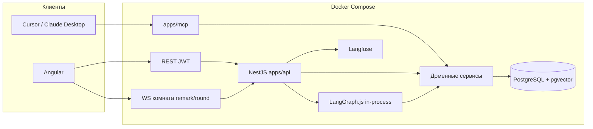
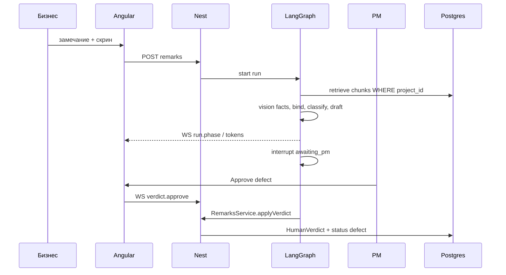

# Архитектура

Один процесс API, одна БД, один MCP-процесс как фасад. Нет микросервисов.

## Границы

| Компонент | Можно | Нельзя |
|---|---|---|
| Angular | REST + WS, экраны из `docs/ui` | Свой бизнес-вердикт на клиенте |
| REST | CRUD + команды, которые зовут сервисы | Обходить membership |
| WS | Фазы, токены, HITL на том же `AgentRun` | Глобальный чат |
| `AgentModule` | Ноды графа вызывают сервисы | `prisma.*` в ноде |
| `apps/mcp` | Те же сервисы, что REST | Свой SQL |
| `RagModule` | Search с `WHERE project_id` | Фильтр «в промпте» |
| `DiffModule` | pixelmatch / cannot_compare | Отдать сравнение пикселей в LLM |

## Путь запроса: триаж

## Путь: ретест

Новый скрин → `DiffModule` → триплет old/new/diff в vision (пояснить, не закрыть) → interrupt `business` → только тогда `closed`.

## Заменяемые куски

- LLM-провайдер за `LlmModule`
- embedding-модель (одна на индекс)
- Langfuse ↔ LangSmith как бэкенд трейсов
- pixelmatch ↔ odiff

Не заменять: pgvector как основное хранилище, HITL, SQL-тенанси.
