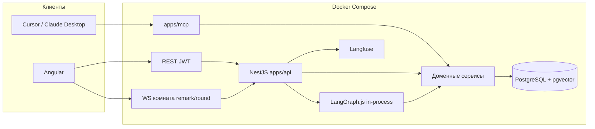
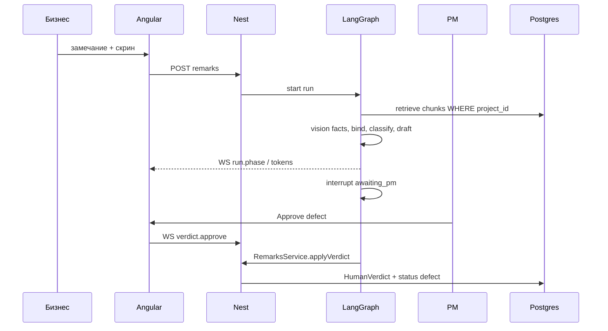

# Архитектура

Один процесс API, одна БД, один MCP-процесс как фасад. Нет микросервисов.

## Границы

| Компонент | Можно | Нельзя |
|---|---|---|
| Angular | REST + WS, экраны из `docs/ui` | Свой бизнес-вердикт на клиенте |
| REST | CRUD + команды, которые зовут сервисы | Обходить membership |
| WS | Фазы, токены, HITL на том же `AgentRun` | Глобальный чат |
| `AgentModule` | Ноды графа вызывают сервисы | `prisma.*` в ноде |
| `apps/mcp` | Те же сервисы, что REST | Свой SQL |
| `RagModule` | Search с `WHERE project_id` | Фильтр «в промпте» |
| `DiffModule` | pixelmatch / cannot_compare | Отдать сравнение пикселей в LLM |

## Путь запроса: триаж

## Путь: ретест

Новый скрин → `DiffModule` → триплет old/new/diff в vision (пояснить, не закрыть) → interrupt `business` → только тогда `closed`.

## Чанкинг и retrieve (фаза 2)

Код: `apps/api/src/rag/chunker.ts`, сравнение: `apps/api/src/rag/chunking-eval.ts` (запуск с `OPENAI_API_KEY`).

**Решение.** Единица чанка — раздел документа по заголовкам (`## 2.1 Primary` в markdown/DOCX, «2.1 Primary» строкой в тексте из PDF), подпись раздела хранится в `DocumentChunk.section` («§2.1 Primary») и идёт в цитату на карточке. В эмбеддинг уходит путь заголовков плюс текст раздела; разделы длиннее 220 слов режутся на окна с перекрытием 40 слов, но остаются подписаны своим разделом. Embedding-модель одна на индекс: `text-embedding-3-small`, 1536 измерений, тип колонки `vector(1536)`, индекс HNSW по косинусу (ivfflat из README требует обучения на уже заполненной таблице и на пустом индексе даёт плохой recall). Фильтр `WHERE "projectId" = $current` стоит в самом SQL retrieve, индекс его не заменяет.

**Что пробовали** (fixtures/spec + fixtures/protocol, 8 вопросов из evals/DEMO, реальные эмбеддинги, 3 сентября 2026):

| Стратегия | Чанков | top-1 | top-3 |
|---|---|---|---|
| A. по заголовкам, путь заголовков в эмбеддинге (прод) | 11 | 6/8 | 8/8 |
| B. по заголовкам, без пути | 11 | 7/8 | 8/8 |
| C. окна 120 слов, overlap 20 | 3 | 5/8 | 8/8 |
| D. окна 60 слов, overlap 10 | 6 | 4/8 | 8/8 |

Выводы. Слепые окна проигрывают не столько по рангу, сколько по смыслу: чанк C/D не знает, какой это раздел, и цитата «§2.1» из него не собирается, а вопрос про primary-кнопку в D уезжает на второе место, потому что окно режет раздел 2.1 пополам. Разница A и B — один вопрос: «главную кнопку сделать серой, как привычнее бухгалтерии» в B находит конфликтный §5, а в A путь «Кнопки и цвет» тянет к §2.1. Путь заголовков оставлен, потому что в реальных ТЗ подразделы короткие («2.1 Primary») и без родителя не знают своей темы; на выборке из восьми вопросов это парность, решать будем на golden-сете в фазе 9. Оба вопроса про «дыры» (тёмная тема, Excel) находят §6 «Чего в ТЗ нет» на первом-третьем месте — это ожидаемо: класс `unspecified` даёт не retrieve, а нода bind по низкой близости (0.28–0.32 против 0.6+ у прямых попаданий).

## Заменяемые куски

- LLM-провайдер за `LlmModule`
- embedding-модель (одна на индекс)
- Langfuse ↔ LangSmith как бэкенд трейсов
- pixelmatch ↔ odiff

Не заменять: pgvector как основное хранилище, HITL, SQL-тенанси.
