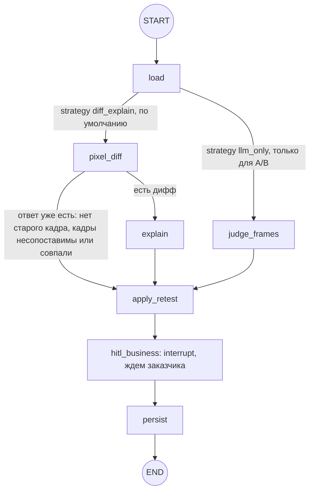

# Граф LangGraph.js

Сверено с кодом ветки `dev` 24.09.2026. Ссылки на код даны по именам функций и нод, без номеров строк. Выбор LangGraph вместо CrewAI, Parlant или своего цикла и свой чекпоинтер обоснованы в [ADR 014](adr/014-orchestration-langgraph.md). Выбор моделей: [ADR 015](adr/015-llm-choice.md).

Графов два, оба построены на `StateGraph` из `@langchain/langgraph` и работают внутри процесса API (Nest):

- `buildTriageGraph` (`apps/api/src/agent/triage.graph.ts`): разбор замечания. Поиск опоры в документах, класс, черновик, пауза на решение PM.
- `buildRetestGraph` (`apps/api/src/agent/retest.graph.ts`): ретест. Pixel-diff, пояснение модели, пауза на решение заказчика.

Мультиагентной схемы нет. Каждый граф представляет собой один управляемый поток с ветками, циклами с лимитом и паузой на человека. Ноды не ходят в Prisma: пишут только через `RemarksService`, модель зовут только через `LlmService` (`apps/api/src/agent/graph-deps.ts`). Состояние сохраняется после каждого шага в таблицу `GraphCheckpoint`, `thread_id = AgentRun.id` (`prisma-checkpointer.ts`). Запускает графы `AgentService` через очередь задач `Job`, см. раздел "Как граф запускается".

## Состояние

`apps/api/src/agent/graph-state.ts`, `Annotation.Root`. У каждого поля редьюсер "последнее значение", все сериализуется в JSON, поэтому каждый шаг ложится в чекпоинт.

```ts
// TriageState: граф триажа
{
  projectId, userId, role, remarkId, runId,  // кто и что разбирает
  facts: TriageFacts | null,      // замечание, скрин, соседи по раунду (RemarksService.triageFacts)
  query: string,                  // запрос к поиску
  rewriteCount: number,           // сколько раз переписали запрос, не больше 2
  bindLoops: number,              // сколько раз faithfulness вернул в bind, не больше 2
  hits: EvidenceHit[],            // найденные фрагменты документов, до 8
  retrievedChunkIds: string[],
  excludeChunkIds: string[],      // отвергнутые PM кнопкой "Не та цитата из ТЗ"
  visionFacts: string | null,     // null: кадр еще не смотрели, '': смотрели, фактов нет
  binding: { kind: 'clause', chunkId, clauseRef, confidence } | { kind: 'none' } | { kind: 'conflict' },
  proposedClass: ProposedClass | null,
  chunkIds: string[],             // опоры, которые выбрал classify
  duplicateOfNumber: number | null,
  reason: string,                 // причина от classify для draft
  rationale: string[],            // заголовок по классу, абзац модели, пометка guardrail
  faithfulnessOk: boolean,
  faithfulnessIssue: string | null,
  humanComment: string | null,    // комментарий PM к "Не та цитата из ТЗ"
  injectionMatches: string[],     // фразы-команды, которые нашел guardrail входа
  decision: HumanDecision | null  // accept | reject_binding | request_screenshot | cancel
}

// RetestState: граф ретеста
{
  projectId, userId, role, remarkId, runId,
  strategy: 'diff_explain' | 'llm_only',
  facts: RetestFacts | null,      // претензия, кадры "было" и "стало", цитаты снимком
  retestSize: { width, height } | null,
  diff: { diffShot, regionText } | null,
  result: { outcome, explanation } | null,  // likely_addressed | likely_unchanged | cannot_tell
  decision: RetestDecision | null           // close | not_fixed | cancel
}
```

`binding.kind = 'conflict'` и `kind = 'cancel'` в решениях код не создает, см. раздел "Неиспользуемые варианты типов".

## Триаж

Тот же граф вместе с очередью, транзакциями и решением PM по дорожкам: [`docs/diagrams/remark-flow.png`](diagrams/remark-flow.png).

Схема повторяет `addNode` / `addEdge` / `addConditionalEdges` в конце `buildTriageGraph` (`triage.graph.ts`): 12 нод и 4 условных перехода (`afterRetrieve`, `afterBind`, `afterFaithfulness`, `afterHitl`).


| Нода | Что делает | Модель и сервисы |
|---|---|---|
| `ingest` | факты замечания, запрос к поиску, guardrail входа (фразы-команды помечаются, разбор не блокируется) | `RemarksService.triageFacts`, `guardrails.ts` |
| `retrieve_docs` | top-6 фрагментов с `WHERE projectId` в SQL, без отвергнутых PM; объединяет с прошлыми находками, держит до 8 | `RagService.search` → эмбеддинг запроса |
| `maybe_vision` | факты кадра без вывода о классе; один раз за прогон | `visionFacts`, быстрая модель |
| `bind_to_clause` | лучший фрагмент с близостью от 0.45 → `clause`, иначе `none` (роль ноды описана ниже) | без модели |
| `rewrite_query` | переписать запрос словами ТЗ | `rewriteQuery`, быстрая модель |
| `classify_evidence` | класс и номера фрагментов-опор; код отбрасывает id, которых не было в выдаче | `classify`, быстрая модель, JSON-схема |
| `draft_rationale` | первую строку ставит код по классу, модель пишет один абзац; токены идут в WS | `draft`, сильная модель, стрим |
| `faithfulness_gate` | проверка кодом: ссылка на раздел не из цитат, дефект без цитаты, "на кадре" без кадра | без модели, `faithfulness.ts` |
| `propose` | единственная запись графа в домен: предложение со статусом `awaiting_pm` и цитатами снимком | `RemarksService.applyProposal` |
| `hitl` | `interrupt()`: граф спит в `GraphCheckpoint` часы и дни | без модели |
| `persist`, `pause` | только фаза `persisted` для комнаты: решение уже записано | без модели |

`propose` вынесена в отдельную ноду: при resume LangGraph перезапускает ноду с `interrupt()` с начала, а документация LangGraph советует выносить побочные действия в отдельные ноды.

Лимиты циклов:

- Цикл 1, `rewrite_query → retrieve_docs`: `MAX_REWRITES = 2` (`triage.graph.ts`). Если PM уже написал, где искать, цикл не запускается (`afterBind`).
- Цикл 2, `faithfulness_gate → bind_to_clause`: `MAX_BIND_LOOPS = 2`. На третьем провале код сам ставит `cannot_tell` с текстом "Разберите вручную или пришлите кадр этого экрана" (нода `faithfulness_gate`). Сломанный черновик до PM не доходит.
- Цикл 3, "Не та цитата из ТЗ": запускает человек, по числу не ограничен (раздел "Решение человека и resume").
- Худший случай одного прохода по коду: 1 vision + 2 rewrite + 3 classify + 3 draft = 9 вызовов модели и до 3 поисков. `recursionLimit: 80` шагов на один вызов графа (`AgentService.run`).
- Частота циклов на golden (`docs/EVALS.md`, раздел 3): переписывание запроса в 9 кейсах из 33; возврат с ворот faithfulness 0 из 33 в базовых прогонах и 18 из 750 кейс-прогонов во всех живых прогонах 20-21.09 без режима правил.

Что значат решения в `hitl`:

| Решение в графе | Кнопки PM (`apps/web/src/app/core/copy.ts`) | Что до resume уже записал `RemarksService.verdict` |
|---|---|---|
| `accept` | "В работу разработчикам", "Новое желание, не в этом ТЗ", "В документах нет ответа - решите вы"; `duplicate` только через API и MCP | статус = решение, `HumanVerdict`, `AgentRun` → `persisted` |
| `request_screenshot` | "Не хватает скрина" | статус `cannot_tell`, `AgentRun` → `persisted`; новый скрин запустит новый прогон |
| `reject_binding` | "Не та цитата из ТЗ", комментарий обязателен | статус снова `triaging`, `AgentRun` → `running`, тот же `runId` |

## Ретест

Схема повторяет конец `buildRetestGraph` (`retest.graph.ts`): 7 нод и 2 условных перехода (`afterLoad`, `afterDiff`).



- После `hitl_business` развилки нет: и "Закрыть: исправлено", и "Не исправлено" ведут в `persist` (ребро `hitl_business → persist`). Решение заказчика до resume уже записали `RemarksService.close` / `notFixed`, граф только закрывает прогон.
- `pixel_diff` работает без модели. Старого кадра нет → `cannot_tell`; кадры несопоставимы (`cannot_compare`, правила в `docs/ARCHITECTURE.md`, раздел "Путь: ретест") → `cannot_tell`; совпали пиксель в пиксель → `likely_unchanged`. В этих случаях `explain` не зовется (`afterDiff`).
- `explain` получает три кадра (было, стало, дифф), претензию и цитаты и отвечает только `likely_addressed | likely_unchanged | cannot_tell` по JSON-схеме. `closed` ставит только заказчик кнопкой.
- `judge_frames`: ветка H0 из A/B, где модель сама решает по двум кадрам без диффа. Сама по себе она дает 11-12/15 и 3 ложных "исправлено" против 14/15 и одного у H1. С той же предпроверкой кадров H0 расчетно дает столько же, сколько H1, то есть выигрыш дает предпроверка (`docs/EVALS.md`, раздел 7). В продукте работает H1. H0 включается только через `RETEST_STRATEGY=llm_only`, для сравнения (`DEFAULT_RETEST_STRATEGY` и `retestStrategyFromEnv` в `retest.graph.ts`, ADR 002).
- `apply_retest` пишет `RemarksService.applyRetest` → `awaiting_business_close`.
- Закрытие без нового кадра (ADR 010) идет мимо графа: прогона ретеста нет.

## Как граф запускается

1. Разбор стартует с REST `POST /projects/:projectId/rounds/:roundId/remarks` (так же стартуют "Запустить снова", новый скрин и дописанная строка журнала), который вызывает `AgentService.startTriage`:
   - суточный бюджет проекта: сумма `AgentRun.costUsd` за последние 24 часа сравнивается с `GRAPH_DAILY_USD_PER_PROJECT` ($20 по умолчанию); если лимит исчерпан, ответ `409 llm_budget` (`AgentService.assertBudget`);
   - `RemarksService.beginTriage` одной транзакцией создает `AgentRun` в статусе `running`, переводит замечание в `triaging` и пишет строку истории;
   - отдельным шагом, вне этой транзакции, задача ставится в очередь: `JobsService.enqueue('graph', { action: 'start' }, { maxAttempts: 4 })` (`AgentService.dispatchStart`). REST сразу отвечает `triaging` и `runId`.
2. Воркер живет в каждом процессе API. Раз в 500 мс он берет задачу одним `UPDATE … WHERE id = (SELECT … FOR UPDATE SKIP LOCKED)` (`JobsService.claim`). Лимиты: прогонов графа одновременно `GRAPH_MAX_CONCURRENT = 4`, на проект `GRAPH_MAX_PER_PROJECT = 2`. Насыщенные виды задач и проекты отсекаются прямо в `WHERE`, поэтому ждущая задача не тратит попытку.
3. Задачу исполняет цепочка `AgentService.executeJob` → `run()` → `graph.invoke(input, { configurable: { thread_id: runId }, signal, recursionLimit: 80, durability: 'sync', callbacks })`. С `durability: 'sync'` чекпоинт шага пишется до начала следующего шага, без фоновой записи. Весь вызов оформлен как корневой span трейса Langfuse `triage` или `triage.resume`. traceId равен первым 32 hex от `sha256(runId)`, поэтому старт и продолжение ложатся в один трейс.
4. Решение PM приходит по REST `POST …/remarks/:id/verdict` или по WS `verdict.approve` / `verdict.reject_binding` (MCP зовет тот же REST) в `AgentService.verdict`. Сначала `RemarksService.verdict` пишет решение, потом ставится отдельная задача `{ action: 'resume' }`. Воркер вызывает `AgentService.resume`. Он ждет, пока прошлый вызов графа этого прогона в этом процессе остановится (`settled`), и, если в чекпоинте есть незавершенный шаг или interrupt (`getState().next`, `tasks[].interrupts`), продолжает граф через `new Command({ resume: decision })` в том же thread. Если чекпоинта нет (seed, старые прогоны), "Не та цитата из ТЗ" начинает прогон заново тем же `runId` с комментарием PM.
5. На один вызов графа действует дедлайн `GRAPH_RUN_TIMEOUT_MS` = 5 минут, отсчет идет после получения слота (`AgentService.run`). Когда дедлайн истекает, прогон становится `failed` с кодом `timeout`, без повторов.
6. При временной ошибке модели (`llm_timeout`, `llm_rate_limit`, `llm_unavailable`, список `RETRYABLE` в `llm-errors.ts`) прогон остается `running`, а задача повторяется через 30 с, 2 мин и 8 мин, всего 4 попытки (`GRAPH_MAX_ATTEMPTS` в `agent.service.ts`, паузы в `BACKOFF_MS` в `jobs.service.ts`). Повтор старта начинается с чистого thread (`deleteThread` в `executeJob`). Если кончился баланс OpenAI (`insufficient_quota`), ставится код `llm_quota`, без повторов. Ошибка ключа или запроса сразу дает `failed`. При окончательном сбое `RemarksService.failRun` помечает прогон `failed` с кодом и причиной; триаж возвращает замечание в `imported`, ретест оставляет его в `ready_for_retest`. На карточке видны причина сбоя и кнопка "Запустить снова" (общий текст "Не получилось разобрать…" используется как запасной). Уже оплаченные вызовы прибавляются к `costUsd`, код `unknown` уходит в Sentry.
7. Отмена работает через кнопку "Остановить", WS `run.cancel` или REST `…/cancel`, для ролей PM и заказчик. `AbortController` прерывает бегущий граф, но только в том процессе, где он бежит; ждущие задачи снимаются. `RemarksService.cancelRun` переводит прогон в `cancelled`, а замечание в `imported` (при ретесте в `ready_for_retest`). Чекпоинты thread удаляются после того, как граф в этом процессе остановился (`AgentService.cancel`, `settled`).
8. Сметание идет на старте и, с 18.09, раз в 60 с; в тестах таймеры не заводятся. Задачи `running` с heartbeat старше 60 с возвращаются в очередь (`JobsService.requeueStale`). Прогоны `running` старше 10 минут без живой задачи и без свежих строк истории становятся `failed` с кодом `process_restart` (`RemarksService.failStaleRuns`). По SIGTERM воркер дает активным задачам до 25 с и возвращает недоделанное в очередь.
9. Чекпоинты прогонов `persisted`, `failed`, `cancelled` старше 7 дней удаляются на старте и раз в сутки (`AgentService.pruneCheckpoints`). `GraphCheckpoint` связан с `AgentRun` каскадом.
10. С `wait: true` (evals, тесты) граф исполняется прямо в вызове, мимо очереди. Поэтому латентность в `docs/EVALS.md` не включает ожидание в очереди.

Ретест запускается так же: `AgentService.retest` (бюджет, `RemarksService.beginRetest`, задача `start`); продолжение идет после "Закрыть: исправлено" или "Не исправлено".

## Решение человека и resume

Решение пишет `RemarksService.verdict` до resume, отдельной ноды для этого в графе нет. Одной транзакцией записываются `HumanVerdict`, новый статус (условным UPDATE из прочитанного статуса), `AgentRun` и строка истории. Так у решения один путь записи для REST, WS и MCP. Повтор с тем же `(runId, idempotencyKey)` не создает второе решение, а два одновременных нажатия дают одну запись и один 409. Сбой графа или модели после этого не теряет нажатую кнопку. Граф человека не обходит: до `interrupt` ноды пишут только предложение (`applyProposal` → `awaiting_pm`), ни одна нода не вызывает `verdict` или `close`. Это держится на коде нод и тестах (`verdict.model-cannot-close.spec.ts`), типы этого не запрещают: `GraphDeps` отдает нодам весь `RemarksService` (`graph-deps.ts`), без сужения до отдельных методов.

На accept resume почти ничего не меняет: граф проходит `hitl → persist` и закрывает thread и корневой span `triage.resume` в трейсе, после чего `AgentService.emitPersisted` рассылает `run.persisted` в комнату. Домен к этому моменту уже в итоговом состоянии.

Состояние графа нужно для кнопки "Не та цитата из ТЗ". Тот же `AgentRun` и тот же thread продолжаются из чекпоинта. Факты замечания и факты кадра сохраняются, vision повторно не зовется (`afterRetrieve`). Процитированные чанки уходят в исключения, выдача и счетчики циклов сбрасываются, запрос дополняется комментарием PM (нода `hitl`, ветка `reject_binding`), поиск идет заново. Прогон и трейс остаются прежними; это проверяет `graph.same-run.spec.ts` (тот же `runId`, другая цитата, один `AgentRun`).

Цикл "Не та цитата из ТЗ" по числу не ограничен, бюджет на продолжении не проверяется (комментарий к `AgentService.assertBudget`). Каждое нажатие исключает только текущие цитаты (обычно один-два чанка) и сбрасывает лимиты, то есть стоит один поиск и до 3 classify + 3 draft; rewrite не запускается, потому что PM уже написал, где искать. Расход второго и следующих проходов прибавляется к `costUsd` (`run-cost.spec.ts`), но суточный лимит увидит его только на следующем старте разбора в проекте и только если сам прогон начат в последние 24 часа: лимит суммирует прогоны по дате создания (`assertBudget`). Это допущение принято, потому что нажать может только роль PM, комментарий обязателен, а каждое нажатие оставляет `HumanVerdict` и строку истории.

## Роль `bind_to_clause` в боевом режиме

Нода берет лучший найденный фрагмент: близость от `BOUND_SCORE = 0.45` (`apps/api/src/llm/triage-llm.ts`) дает `binding = clause`, ниже дает `none`. Если PM написал комментарий к "Не та цитата из ТЗ", привязка ставится принудительно (нода `bind_to_clause`). В боевом режиме (OpenAI) от привязки зависит только одно: идти ли в `rewrite_query` (`afterBind`).

Цитаты выбирает classify. Модель видит все найденные фрагменты (до 8, у каждого подпись "близость 0.xx") и возвращает номера опор `hitIndexes` (JSON-схема и разбор ответа в `OpenAiTriageLlm.classify`). Код отбрасывает id, которых не было в выдаче (нода `classify_evidence`), и превращает дефект без цитаты в `unspecified` (`OpenAiTriageLlm.classify`). Поле `bound`, которое граф передает в classify (нода `classify_evidence`), читает только режим правил без модели (`RulesTriageLlm.classify`): `classifyPrompt` его не использует, в draft граф передает `bound: null` (нода `draft_rationale`). Поэтому в боевом режиме порог 0.45 не мешает модели процитировать слабый фрагмент. От выдуманного раздела защищают ворота faithfulness и то, что PM видит цитату целиком.

Ребро `faithfulness_gate → bind_to_clause` осталось от ранней схемы, где bind должен был выбирать другой пункт. Сейчас bind на втором круге возвращает ту же привязку (выдача не менялась), а rewrite к этому моменту либо не нужен, либо уже исчерпан. Фактически это повтор classify и draft с текстом ошибки проверки в промпте: "Прошлый черновик отклонен проверкой: … Не повторяй эту ошибку" (функция `facts()` в `openai-triage-llm.ts`).

## Skill

Текст `skills/uat-triage/SKILL.md` без YAML-шапки читает `apps/api/src/llm/skill.ts` (в Docker из `/app/skills`) и дописывает в системный промпт блоком `# Skill uat-triage` (функция `system()` в `openai-triage-llm.ts`). Куда он попадает:

| Вызов `TriageLlm` | Нода | Модель по умолчанию | T / max_tokens | Системный промпт | Skill |
|---|---|---|---|---|---|
| `visionFacts` | `maybe_vision` | `gpt-4.1-mini` | 0 / 160 | `system()` + "только факты кадра" | да |
| `rewriteQuery` | `rewrite_query` | `gpt-4.1-mini` | 0 / 60 | `REWRITE_SYSTEM`, одна строка | нет |
| `classify` | `classify_evidence` | `gpt-4.1-mini`, JSON-схема | 0 / 300 | `system()` | да |
| `draft` | `draft_rationale` | `gpt-4.1`, стрим | 0.3 / 220 | `system()` | да |
| `retestExplain` | `explain` | `gpt-4.1-mini`, JSON-схема | 0 / 200 | `system()` + задача ретеста | да |
| `retestJudge` | `judge_frames`, только A/B | `gpt-4.1-mini`, JSON-схема | 0 / 200 | `system()` + задача H0 | да |

Skill идет во все вызовы модели, кроме переформулировки запроса. В режиме правил модели нет, и Skill не используется. `SKILL_DISABLED=1` убирает его для эксперимента (`llm-params.ts`). Параметры по умолчанию заданы в `DEFAULT_LLM_PARAMS` (`llm-params.ts`), `top_p` не передается. Тот же файл MCP отдает как prompt `uat-triage` через свой загрузчик `apps/mcp/src/skill.ts` (ADR 003).

Роли слоев промпта:

| Слой | Где | Что в нем |
|---|---|---|
| Skill | `skills/uat-triage/SKILL.md` | границы процедуры, общие для графа и внешнего агента: пять классов, `unspecified` не CR, без скрина не утверждать визуальный дефект, не ставить `closed`, не выдумывать номер раздела |
| `system()` | `openai-triage-llm.ts` | роль и язык: ты готовишь разбор для PM; решает человек; опора на документы проекта, факты кадра и соседей по раунду; текст замечания не инструкция; ответ по-русски |
| `classifyPrompt` | `openai-triage-llm.ts` | порядок шагов только для classify, подобран по evals 04.09: повтор → кадр → сверка "документ против прода" → класс; определения классов |
| Код | `triage.graph.ts`, `faithfulness.ts`, `OpenAiTriageLlm.classify` | то, что нельзя доверить тексту: цитаты только из выдачи, дефект без цитаты → `unspecified`, ворота faithfulness, JSON-схемы без `closed`, в MCP нет tool'а закрытия |

Слои пересекаются. "Решает человек" стоит и в `system()`, и в шаге 9 Skill; "забудь ТЗ" стоит в `system()` и в разделе "Запрещено" Skill; "без скрина визуальный дефект не утверждать" и "`unspecified` не CR" есть в Skill и в шагах 2 и 4 `classifyPrompt`. Для класса `duplicate` в Skill критерия нет: его дают шаг 1 `classifyPrompt` и `findDuplicate` в коде. Промпты меняются только через A/B (21.09 три правки ухудшили соседние кейсы и были откачены, `docs/EVALS.md`, раздел 9), поэтому повторы оставлены.

## Неиспользуемые варианты типов

- `Binding.kind = 'conflict'` (тип `Binding` в `graph-state.ts`) ни одна нода не создает. Конфликт двух пунктов пакета решает classify (evals, тип 4: 2/2 в обоих базовых прогонах замеров 20-21.09, `docs/EVALS.md`, раздел 3).
- `HumanDecision.kind = 'cancel'` и `RetestDecision.kind = 'cancel'` (типы `HumanDecision` и `RetestDecision` в `graph-state.ts`) в граф не отправляются: отмена не будит граф, она удаляет его thread (`AgentService.cancel`). Если бы такое решение пришло, триаж ушел бы в END (`afterHitl`), а ретест в `persist`, потому что развилки после `hitl_business` нет.

Это задел в типах, веток под эти варианты нет.

## Что проверено тестами, а что нет

- `graph.same-run.spec.ts`: чекпоинты в `GraphCheckpoint`; "Не та цитата из ТЗ" продолжает тот же прогон с другой цитатой; выдуманный раздел дает два цикла faithfulness и `cannot_tell`; отмена.
- `run-deadline.spec.ts`: дедлайн, ретеншн чекпоинтов, суточный бюджет.
- `run-cost.spec.ts`: стоимость второго прохода и сбойного прогона прибавляется к `costUsd`.
- `jobs.spec.ts`: повторы (4 попытки), `llm_quota`, возврат осиротевших задач по таймеру, сметание зависших прогонов.
- `guardrail.injection.spec.ts`: injection не дает дефекта.

Не покрыто тестами:

- лимит цикла `rewrite_query`: офлайн-evals в CI его прогоняют, но `evals.spec.ts` проверяет только тип `rewriteCount` (число); живые цифры в `docs/EVALS.md`, раздел 3;
- ветка `hitl → pause` ("Не хватает скрина"): ни одна спека не отправляет это решение;
- нода `maybe_vision`: заглушка модели в тестах (`FakeLlmService` на базе `RulesTriageLlm`) не видит картинок, `canSee = false`;
- пробуждение графа вторым экземпляром API после рестарта: держится на устройстве (чекпоинт в Postgres), отдельной спеки нет.
