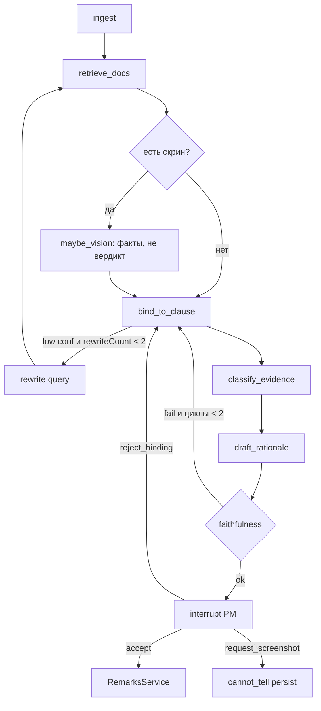
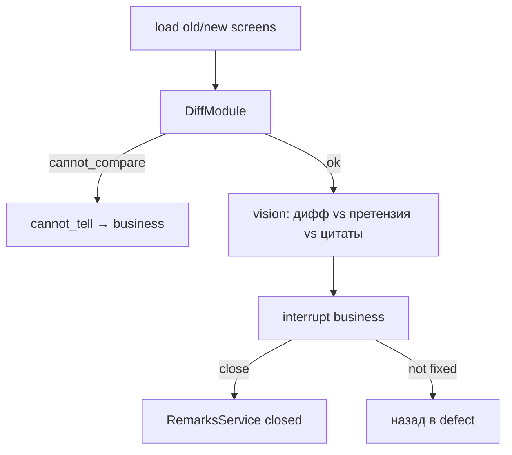

# Граф LangGraph.js

Один граф (плюс тот же граф с `mode: retest`). Не CrewAI, не мультиагентный цирк.

Пакет: `@langchain/langgraph` in-process в `AgentModule`. Ноды вызывают Nest-сервисы. Checkpoint: Postgres (`GraphCheckpoint`). Interrupt живёт дольше HTTP.

## Состояние (минимум)

```ts
type GraphState = {
  projectId: string;
  remarkId: string;
  runId: string;
  mode: 'triage' | 'retest';
  query: string;
  rewriteCount: number;      // max 2
  retrievedChunkIds: string[];
  visionFacts?: string;
  binding?: { clauseRef: string; confidence: number } | { kind: 'none' | 'conflict' };
  proposedClass: string;
  rationale: string;
  faithfulnessOk: boolean;
  humanComment?: string;
};
```

## Триаж



Лимит циклов: **2**. Дальше `cannot_tell`, не бесконечный LLM.

## Ретест



Модель на ретесте возвращает только `likely_addressed | likely_unchanged | cannot_tell`. Не `closed`.

## Skill

Текст `skills/uat-triage/SKILL.md` подмешивается в `classify`, `draft`, `explain` (ретест).
