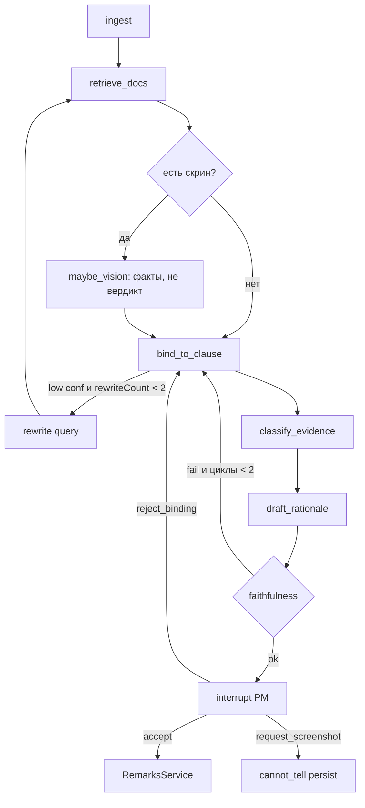
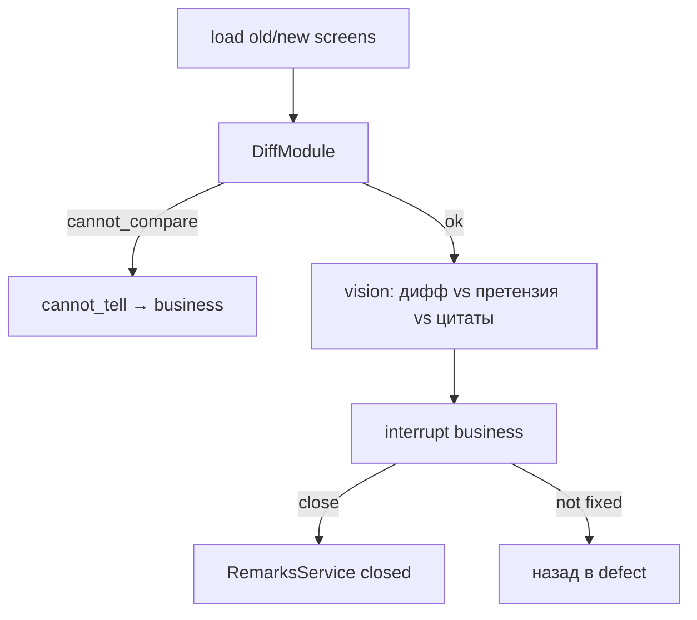

# Граф LangGraph.js

Один граф (плюс тот же граф с `mode: retest`). Не CrewAI, не мультиагентный цирк.

Пакет: `@langchain/langgraph` in-process в `AgentModule`. Ноды вызывают Nest-сервисы. Checkpoint: Postgres (`GraphCheckpoint`). Interrupt живёт дольше HTTP.

Реализация (фаза 6): `apps/api/src/agent/triage.graph.ts`, `retest.graph.ts`, состояние — `graph-state.ts` (Annotation), чекпоинтер — `prisma-checkpointer.ts` (порт MemorySaver на таблицу `GraphCheckpoint`; `thread_id = AgentRun.id`), оркестратор — `agent.service.ts` (`startTriage` / `verdict` / `cancel` / `retest` / `close` / `notFixed`; REST и WS зовут одно и то же). Прогон идёт в фоне после ответа REST, фазы — событиями `RunEvents` в комнату WS. Отличия от схемы ниже: перед `interrupt` стоит отдельная нода `propose` (запись предложения через `RemarksService.applyProposal`), потому что LangGraph при resume перезапускает ноду с `interrupt` с начала; `reject_binding` возвращается в `retrieve_docs` с комментарием PM и исключёнными чанками, а не сразу в `bind` — новая цитата требует нового поиска. `faithfulness` — без LLM (`faithfulness.ts`): ссылка на раздел вне retrieve, дефект без цитаты, «на кадре» без кадра. Vision-нода пропускается, если модель не умеет смотреть кадр (правила без ключа). Первая строка черновика ставится кодом по классу (docs/ui/COPY.md), модель пишет только абзац обоснования. Ответ человека приходит в `interrupt` как `{ kind: 'accept' | 'reject_binding' | 'request_screenshot' | 'cancel' }`; сам вердикт уже записан `RemarksService.verdict` до resume. `run.cancel` прерывает бегущий граф (AbortSignal) или снимает чекпоинты спящего; run = `cancelled`, замечание → `imported`. Прогоны, оставшиеся `running` после падения процесса дольше 10 минут, на старте помечаются `failed` (замечание → `imported`, «Запустить снова»).

## Состояние (минимум)

```ts
type GraphState = {
  projectId: string;
  remarkId: string;
  runId: string;
  mode: 'triage' | 'retest';
  query: string;
  rewriteCount: number;      // max 2
  retrievedChunkIds: string[];
  visionFacts?: string;
  binding?: { clauseRef: string; confidence: number } | { kind: 'none' | 'conflict' };
  proposedClass: string;
  rationale: string;
  faithfulnessOk: boolean;
  humanComment?: string;
};
```

## Триаж



Лимит циклов: **2**. Дальше `cannot_tell`, не бесконечный LLM.

## Ретест



Модель на ретесте возвращает только `likely_addressed | likely_unchanged | cannot_tell`. Не `closed`.

Реализация: нода `pixel_diff` (DiffService) → `explain` только если дифф есть и кадры не совпали пиксель в пиксель (без модели: `cannot_tell`, «Относится ли это к претензии — решите вы»); `apply_retest` пишет `RemarksService.applyRetest` → `awaiting_business_close`; `interrupt` бизнеса; «Закрыть: исправлено» / «Не исправлено» — `RemarksService.close` / `notFixed`, затем граф закрывается.

Закрытие без нового кадра (ADR 010) идёт мимо графа: заказчик нажимает «Закрыть: исправлено» прямо в `ready_for_retest`, прогона ретеста нет, `AgentService.close` граф не возобновляет. Модель в этом переходе не участвует и `closed` по-прежнему не ставит.

A/B (фаза 9, ADR 002 п.4): в состоянии графа есть `strategy`. `diff_explain` — путь выше (победитель, дефолт `DEFAULT_RETEST_STRATEGY`); `llm_only` — после `load` идёт нода `judge_frames`: модель получает только «было» и «стало» (`TriageLlm.retestJudge`) без диффа и без проверки размеров. Переключатель — `RETEST_STRATEGY` (`AgentService.retestStrategy`); раннер evals гоняет обе ветки на одном коде, цифры — `docs/EVALS.md`.

## Skill

Текст `skills/uat-triage/SKILL.md` подмешивается в `classify`, `draft`, `explain` (ретест) — `apps/api/src/llm/skill.ts` читает файл (в Docker он копируется в `/app/skills`).

## LLM

`LlmModule`: `OpenAiTriageLlm` с ключом (vision facts / rewrite / classify / explain — `LLM_MODEL_FAST`, по умолчанию `gpt-4.1-mini`, temperature 0, JSON-schema; draft — `LLM_MODEL_STRONG`, по умолчанию `gpt-4.1`, temperature 0.3, стрим токенов → `run.token`), без ключа — `RulesTriageLlm` (правила по близости retrieve, как заглушка фазы 3). Обе реализации одного контракта `TriageLlm`; граф не знает, какая под ним. Токены прогона копятся в `AgentRun.inputTokens/outputTokens`.
