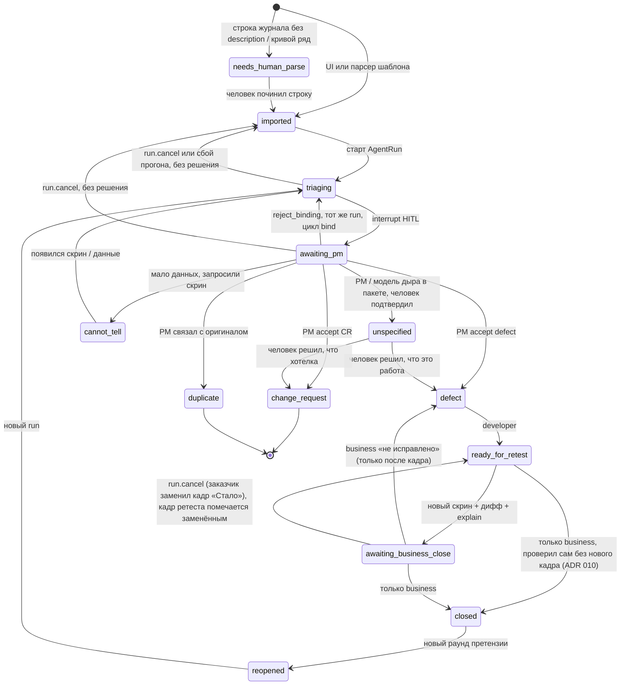

# Статусная машина Remark

Смысл статусов не менять. Не добавлять Jira-поля (`assignee`, `sprint`, `storyPoints`).

## Легальные статусы

```text
imported | needs_human_parse | triaging | awaiting_pm
defect | change_request | unspecified | duplicate | cannot_tell
ready_for_retest | awaiting_business_close | closed | reopened
```

`in_dev` из доктрины **не вводим**: разработчик работает с `defect`. Меньше канбана.

## Переходы



Кадры несопоставимы — это не отдельный статус: ретест всё равно приходит в `awaiting_business_close` с `retest.outcome = cannot_tell` и причиной, решает заказчик.

## Кто имеет право

| Действие | Роль |
|---|---|
| Создать замечание, импорт шаблона, закрыть (после ретеста или сразу после «Готово», если проверил сам — ADR 010), «не исправлено» (только с новым кадром) | `business` |
| Решение до разработчика, reject_binding | `pm` |
| `ready_for_retest` | `developer` |
| Совет по `awaiting_pm` (`DeveloperAdvice`: не решение, статус не меняет, граф не трогает) | `developer` |
| Старт триажа, дифф, черновик модели | система |
| `run.cancel` (без решения) | `pm`, `business` |
| `closed` | только `business` |
| Авто-close модели | **запрещено** |

Разработчик **не** видит `awaiting_pm` как свою очередь (журнал раунда и `dev-queue` его не отдают), но видит такие замечания отдельным списком «Сейчас у руководителя приёмки» (`advisory-queue`) и может **посоветовать** один из вариантов PM — совет живёт в `DeveloperAdvice`, показывается PM рядом с вариантом и ничего не решает: переход делает только решение PM.

## Кого ждёт статус

Писем нет (ADR 013 заменил ADR 009): очередь человека — журнал («ждут меня»). Статус ждёт роль: `awaiting_pm` → pm; `defect` (решение PM или «не исправлено» от бизнеса) → developer; `ready_for_retest` («Готово» разработчика — проверить: закрыть сразу или приложить новый кадр), `awaiting_business_close`, `cannot_tell` → business.

## Закрытие без нового кадра

«Готово» разработчика не требует круга ретеста (ADR 010): заказчик, проверивший исправление на стенде, закрывает замечание сразу — `ready_for_retest → closed`, комментарий по желанию. Граф в этом переходе не участвует, модель «исправлено» не утверждает. Вернуть разработчику («не исправлено») можно только после нового кадра: спор с «Готово» ведётся новым кадром. Как закрыли, видно по строке истории `close`: `fromStatus = ready_for_retest` — проверено заказчиком без кадра, `awaiting_business_close` — после ретеста; карточка отдаёт это как `closedVia` и `closeComment`.

## Повтор претензии и закрытие раунда

`closed → reopened` — не смена статуса той же строки: закрытое замечание остаётся закрытым со своими кадрами, цитатами и решением, а заказчик (`POST /remarks/:id/reopen`) создаёт в открытом раунде **новое** замечание со ссылкой `origin` на оригинал, тем же текстом и кадром; оно стартует как `reopened → triaging`. Оригинал показывает `reopenedBy`. Так спор «это же то, что вы закрыли в раунде 2» ведётся по двум записям, а не по перезаписанной одной.

Раунд закрывается (`POST /rounds/:id/close`, pm или business), только когда ни одно его замечание ничего не ждёт: `closed`, `change_request`, `duplicate`. Всё остальное — 409 с перечнем. В закрытый раунд нельзя добавить замечание и импортировать журнал; `reopen` раунда снимает закрытие. Новый раунд (`POST /rounds`) открывается по тому же правилу: пока хоть одно замечание проекта ждёт чего-то, кроме `closed` / `change_request` / `duplicate`, — 409 с номером раунда и числом нерешённых; в меню «Новый раунд» серый с подсказкой.

## Как переход записывается

Сервис проверяет прочитанный статус (`assertTransition`), а затем пишет условно: `UPDATE … WHERE id = … AND status IN (ожидаемые)` внутри транзакции вместе с `HumanVerdict` / `AgentRun`. Ноль обновлённых строк — 409 «карточка изменилась, обновите её»; фронт на 409 перечитывает карточку. Так два человека, нажавшие кнопки одновременно, не получают «произвольного победителя».

В той же транзакции пишется строка истории `RemarkStatusChange`: откуда, куда, кто — имя снимком на момент действия — и в какой роли (или система — граф, сбой), каким прогоном, короткая пометка (что предложила модель, итог ретеста, причина сбоя), слова человека (комментарий к решению, к закрытию) и кадр действия. Статус на карточке перезаписывается, история — только дописывается, и это держит Postgres: триггер `rr_append_only` не даёт `UPDATE` и `DELETE` строк истории и событий раунда и не даёт удалить кадр (ADR 011). Кадры не удаляются: «не исправлено», новый ретест и отмена помечают прежний кадр заменённым (`supersededAt`) — с карточки он уходит, из истории нет. Решения без смены статуса тоже оставляют строку: связь с дублем (`link_duplicate`), повтор претензии на закрытом оригинале (`reopened_as`); открытие, закрытие и повторное открытие раунда — `RoundEvent`; предложение модели остаётся и в `AgentRun` (`proposedClass`, `rationale`, `visionFacts`), так что новый прогон после `cannot_tell` или повтора претензии не затирает прежний разбор. Отсюда «когда отдали на ретест», «сколько раз возвращали» и «что модель предлагала до правки» — `GET /remarks/:id/history` и раздел «История» на карточке.
