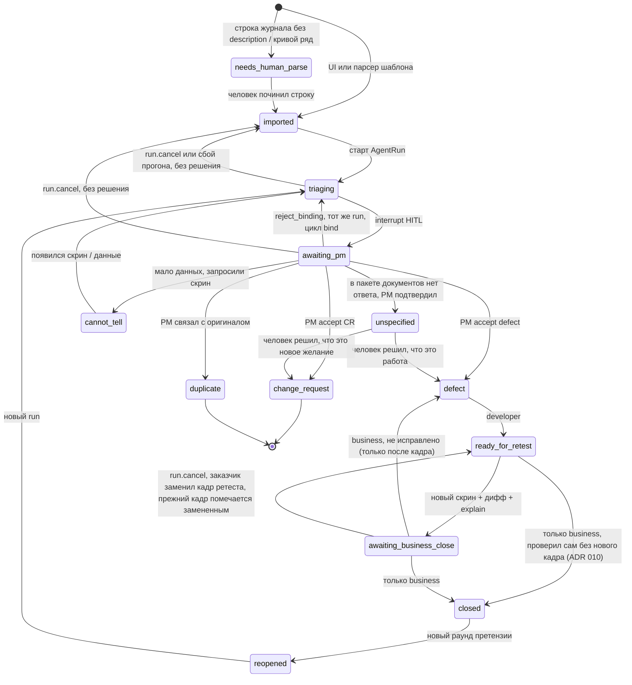

# Статусная машина Remark

Статусы соответствуют enum `RemarkStatus` (`packages/db/prisma/schema.prisma`), переходы проверяет `RemarksService`. Смысл статусов менять нельзя. Полей в духе Jira (`assignee`, `sprint`, `storyPoints`) у замечания нет.

## Допустимые статусы

```text
imported | needs_human_parse | triaging | awaiting_pm
defect | change_request | unspecified | duplicate | cannot_tell
ready_for_retest | awaiting_business_close | closed | reopened
```

Статуса `in_dev` нет: разработчик работает с `defect`.

## Переходы



Для несопоставимых кадров отдельного статуса нет. Ретест все равно приходит в `awaiting_business_close` с `retest.outcome = cannot_tell` и причиной, решает заказчик.

## Кто имеет право

| Действие | Роль |
|---|---|
| Создать замечание, импортировать журнал | `business`, `pm` |
| Закрыть (`closed`): после ретеста или сразу после "Готово", если заказчик проверил сам (ADR 010) | только `business` |
| "Не исправлено" (только с новым кадром) | `business` |
| Решение по `awaiting_pm`, `reject_binding` | `pm` |
| Решение по `unspecified` (`defect` или `change_request`) | `pm`, `business` |
| `ready_for_retest` | `developer` |
| Совет по `awaiting_pm` (`DeveloperAdvice`). Совет ничего не решает, статус и граф он не трогает | `developer` |
| Старт триажа, дифф, черновик модели | система |
| `run.cancel` (без решения) | `pm`, `business` |
| Автозакрытие моделью | запрещено |

В очередь разработчика `awaiting_pm` не попадает: журнал раунда и `dev-queue` отдают ему только `defect` и `ready_for_retest`. Такие замечания разработчик видит отдельным списком (`advisory-queue`) и может посоветовать PM один из вариантов. Совет хранится в `DeveloperAdvice` и показывается PM рядом с вариантом. Переход делает только решение PM.

## Кого ждет статус

Писем нет (ADR 013 заменил ADR 009). Очередь человека это журнал с фильтром "Ждут меня".

| Статус | Кого ждет |
|---|---|
| `awaiting_pm` | pm |
| `defect` (решение PM или "Не исправлено" от заказчика) | developer |
| `ready_for_retest` ("Готово" разработчика: закрыть сразу или приложить новый кадр) | business |
| `awaiting_business_close` | business |
| `cannot_tell` | business и pm: кадр может приложить и руководитель приемки |
| `unspecified` (в документах нет ответа, решает заказчик) | business |

Колокольчик ведет в эту очередь (ADR 016). О смене статуса сообщают правила по действию истории (`apps/api/src/notifications/audience.ts`): "ждет вас" получает тот, чья очередь пришла, "к сведению" получает заказчик о вехах. О шагах прогона (`triage`, `retest`, `cancel`, `run_failed`) колокольчик не сообщает.

## Закрытие без нового кадра

После "Готово" разработчика круг ретеста не обязателен (ADR 010). Заказчик, который проверил исправление на стенде, закрывает замечание сразу (`ready_for_retest → closed`), комментарий по желанию. Граф в этом переходе не участвует, модель не утверждает, что замечание исправлено. Вернуть замечание разработчику ("Не исправлено") можно только с новым кадром.

Способ закрытия виден по строке истории `close`. `fromStatus = ready_for_retest` значит, что заказчик проверил без кадра, `awaiting_business_close` значит закрытие после ретеста. Карточка отдает это как `closedVia` и `closeComment`.

## Повтор претензии и закрытие раунда

Переход `closed → reopened` не меняет статус исходной строки. Закрытое замечание остается закрытым со своими кадрами, цитатами и решением. Заказчик (`POST /remarks/:id/reopen`) создает в открытом раунде новое замечание со ссылкой `origin` на оригинал, с тем же текстом и тем же или новым кадром. Новое замечание начинает с `reopened → triaging`, у оригинала появляется `reopenedBy`. Спор "это то же, что закрыли в раунде 2" ведется по двум записям, исходная не перезаписывается.

Раунд закрывается (`POST /rounds/:id/close`, pm или business), только когда все его замечания в `closed`, `change_request` или `duplicate`. Иначе ответ 409 с перечнем. В закрытый раунд нельзя добавить замечание или импортировать журнал, `reopen` раунда снимает закрытие. Новый раунд (`POST /rounds`) открывается по тому же правилу: пока хоть одно замечание проекта в другом статусе, ответ 409 с номером раунда и числом нерешенных. Пункт меню "Новый раунд" в этом случае неактивен и показывает подсказку.

## Как переход записывается

Сервис проверяет прочитанный статус (`assertTransition`), затем пишет условно: `UPDATE … WHERE id = … AND status IN (ожидаемые)` в одной транзакции с `HumanVerdict` или `AgentRun`. Если не обновилась ни одна строка, ответ 409 с просьбой обновить карточку, фронт на 409 перечитывает ее. Когда два человека нажимают кнопки одновременно, проходит одно решение, второе получает 409.

В той же транзакции пишется строка истории `RemarkStatusChange`. В ней записано, из какого статуса и в какой, кто (имя снимком на момент действия) и в какой роли, или система (граф, сбой), каким прогоном. Там же короткая пометка (что предложила модель, итог ретеста, причина сбоя), слова человека (комментарий к решению или к закрытию) и кадр действия.

Статус на карточке перезаписывается, история только дописывается. Это держит Postgres: триггер `rr_append_only` запрещает `UPDATE` и `DELETE` строк истории и событий раунда и не дает удалить кадр (ADR 011). Кадры не удаляются: "Не исправлено", новый ретест и отмена помечают прежний кадр замененным (`supersededAt`). С карточки такой кадр уходит, в истории остается.

Решения без смены статуса тоже оставляют строку: связь с дублем (`link_duplicate`) и повтор претензии на закрытом оригинале (`reopened_as`). Открытие, закрытие и повторное открытие раунда пишутся в `RoundEvent`. Предложение модели остается и в `AgentRun` (`proposedClass`, `rationale`, `visionFacts`), поэтому новый прогон после `cannot_tell` или повтора претензии не затирает прежний разбор.

По истории видно, когда замечание отдали на ретест и сколько раз его возвращали. Историю отдает `GET /remarks/:id/history`, на карточке это раздел "История".

В той же транзакции, под точкой сохранения, пишутся уведомления колокольчика (ADR 016). Если запись уведомлений падает, откатывается только она, переход и строка истории остаются.
