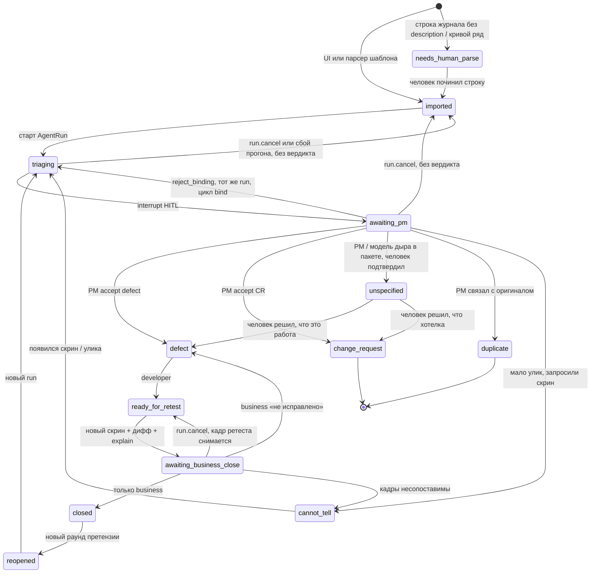

# Статусная машина Remark

Смысл статусов не менять. Не добавлять Jira-поля (`assignee`, `sprint`, `storyPoints`).

## Легальные статусы

```text
imported | needs_human_parse | triaging | awaiting_pm
defect | change_request | unspecified | duplicate | cannot_tell
ready_for_retest | awaiting_business_close | closed | reopened
```

`in_dev` из доктрины **не вводим**: разработчик работает с `defect`. Меньше канбана.

## Переходы



## Кто имеет право

| Действие | Роль |
|---|---|
| Создать замечание, импорт шаблона, закрыть после ретеста | `business` |
| Вердикт до разработчика, reject_binding | `pm` |
| `ready_for_retest` | `developer` |
| Старт триажа, дифф, черновик модели | система |
| `run.cancel` (без вердикта) | `pm`, `business` |
| `closed` | только `business` |
| Авто-close модели | **запрещено** |

Разработчик **не** видит `awaiting_pm` как свою очередь.
