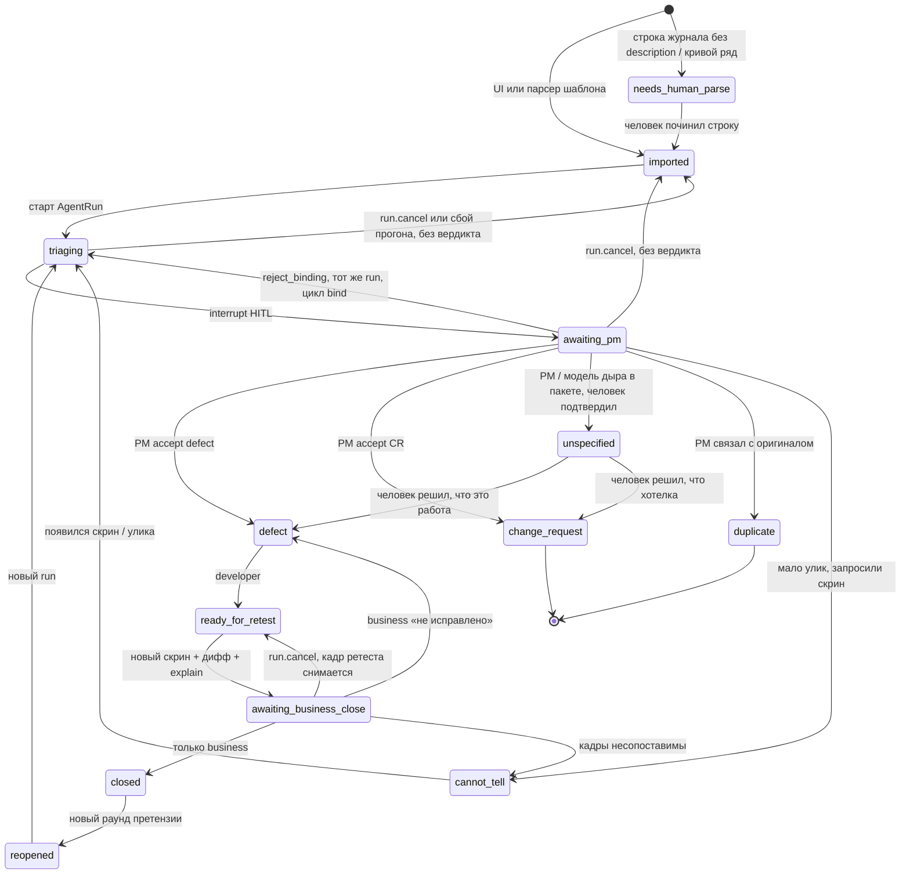

# Статусная машина Remark

Смысл статусов не менять. Не добавлять Jira-поля (`assignee`, `sprint`, `storyPoints`).

## Легальные статусы

```text
imported | needs_human_parse | triaging | awaiting_pm
defect | change_request | unspecified | duplicate | cannot_tell
ready_for_retest | awaiting_business_close | closed | reopened
```

`in_dev` из доктрины **не вводим**: разработчик работает с `defect`. Меньше канбана.

## Переходы



## Кто имеет право

| Действие | Роль |
|---|---|
| Создать замечание, импорт шаблона, закрыть после ретеста | `business` |
| Вердикт до разработчика, reject_binding | `pm` |
| `ready_for_retest` | `developer` |
| Совет по `awaiting_pm` (`DeveloperAdvice`: не вердикт, статус не меняет, граф не трогает) | `developer` |
| Старт триажа, дифф, черновик модели | система |
| `run.cancel` (без вердикта) | `pm`, `business` |
| `closed` | только `business` |
| Авто-close модели | **запрещено** |

Разработчик **не** видит `awaiting_pm` как свою очередь (журнал раунда и `dev-queue` его не отдают), но видит такие замечания отдельным списком «Сейчас у руководителя приёмки» (`advisory-queue`) и может **посоветовать** один из вариантов PM — совет живёт в `DeveloperAdvice`, показывается PM рядом с вариантом и ничего не решает: переход делает только вердикт PM.

## Кому приходит письмо

Уведомление (ADR 009) — не действие и ничего не решает: это письмо роли, которую статус ждёт. `awaiting_pm` → pm; `defect` (вердикт PM или «не исправлено» от бизнеса) → developer; `ready_for_retest` («Готово» разработчика — нужен новый кадр), `awaiting_business_close`, `cannot_tell` → business. Тот, кто нажал, о своём действии письма не получает; всё накопившееся за несколько минут уходит одним письмом.

## Повтор претензии и закрытие раунда

`closed → reopened` — не смена статуса той же строки: закрытое замечание остаётся закрытым со своими уликами и решением, а заказчик (`POST /remarks/:id/reopen`) создаёт в открытом раунде **новое** замечание со ссылкой `origin` на оригинал, тем же текстом и кадром; оно стартует как `reopened → triaging`. Оригинал показывает `reopenedBy`. Так спор «это же то, что вы закрыли в раунде 2» ведётся по двум записям, а не по перезаписанной одной.

Раунд закрывается (`POST /rounds/:id/close`, pm или business), только когда ни одно его замечание ничего не ждёт: `closed`, `change_request`, `duplicate`. Всё остальное — 409 с перечнем. В закрытый раунд нельзя добавить замечание и импортировать журнал; `reopen` раунда снимает закрытие.

## Как переход записывается

Сервис проверяет прочитанный статус (`assertTransition`), а затем пишет условно: `UPDATE … WHERE id = … AND status IN (ожидаемые)` внутри транзакции вместе с `HumanVerdict` / `AgentRun`. Ноль обновлённых строк — 409 «карточка изменилась, обновите её»; фронт на 409 перечитывает карточку. Так два человека, нажавшие кнопки одновременно, не получают «произвольного победителя».

В той же транзакции пишется строка истории `RemarkStatusChange`: откуда, куда, кто и в какой роли (или система — граф, сбой), каким прогоном, короткая пометка (что предложила модель, итог ретеста, причина сбоя). Статус на карточке перезаписывается, история — только дописывается; предложение модели остаётся и в `AgentRun` (`proposedClass`, `rationale`, `visionFacts`), так что новый прогон после `cannot_tell` или повтора претензии не затирает прежний разбор. Отсюда «когда отдали на ретест», «сколько раз возвращали» и «что модель предлагала до правки» — `GET /remarks/:id/history` и раздел «История» на карточке.
